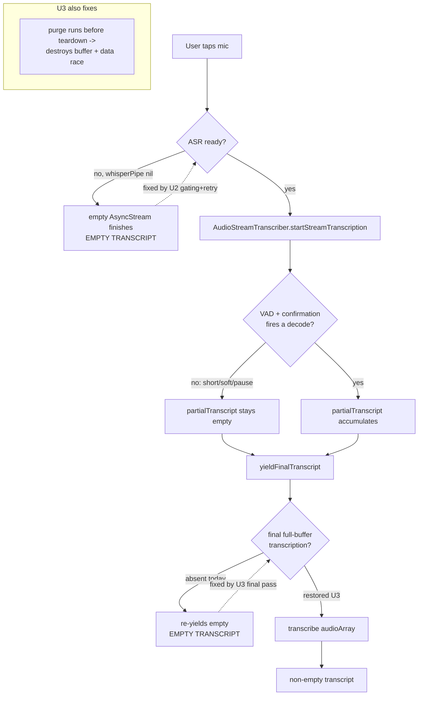
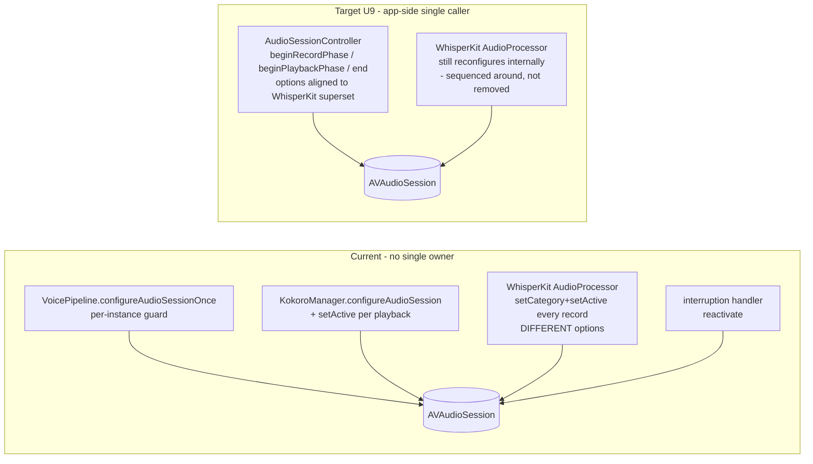
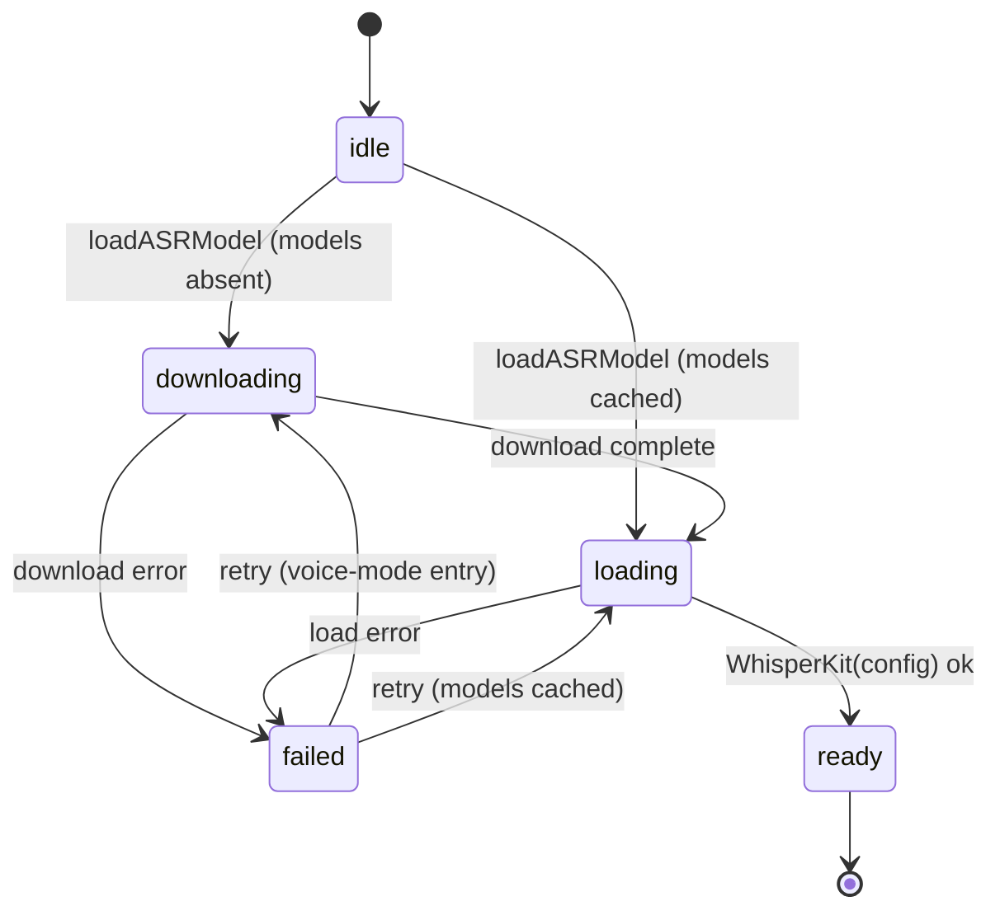

# fix: Voice pipeline STT/TTS reliability on iPhone 17

## Product Contract

### Summary

Fix the on-device voice pipeline so local speech-to-text and text-to-speech work reliably on an iPhone 17 (A19 / iOS 26). This plan lands the full finding set from the 2026-07-05 deep review as one dependency-ordered sequence: first the defects that make voice unusable, then concurrency/memory/audio-session hardening, then cleanup, then a final on-device verification pass that gates the risky latency optimizations. The empty-transcript failure is treated as over-determined (several independent causes), so the plan fixes each cause rather than betting on one.

### Problem Frame

The voice feature (STT -> LLM -> TTS, orchestrated by `VoicePipeline`) has been broken for a long time. Recording frequently yields an empty transcript surfaced to the user as "I didn't catch that. Try again?", and the git history is a graveyard of STT rewrites (Apple Speech -> FluidAudio Parakeet -> WhisperKit) and TTS rewrites (MLX Kokoro -> FluidAudio CoreML) that each fixed one failure while leaving others. The most recent commit added diagnostic logging only; no fix.

A deep multi-agent review (8 dimensions, adversarial per-finding verification, 44 surviving findings) concluded the empty transcript is **over-determined**: several code-provable defects each produce it independently, which is why single-target rewrites never stuck. The review's leading pre-registered hypothesis (audio-session collisions kill the WhisperKit mic tap) was *downgraded* by verification to a real-but-intermittent secondary cause; the dominant causes are ASR-readiness gaps, a deleted final-transcription safety net, and a buffer purge/teardown race. Two further deterministic bugs (cold-launch `chatSession` nil; a Kokoro playback hang) break voice independently of STT, so fixing STT alone is insufficient.

The primary device target is iPhone 17 (A19, iOS 26), though the deployment target is iOS 18. Several fixes' payoff or safety depends on real-device behavior that cannot be verified statically; per the planning decision, those are implemented conservatively and gated behind an explicit on-device verification unit.

### Requirements

- **R1 — Speech is transcribed.** A spoken answer (including short, soft, or pause-leading utterances) produces a non-empty transcript on device, or a clear, actionable failure message — never a silent dead-end.
- **R2 — The AI speaks, or degrades cleanly.** Every generated response is spoken by Kokoro or, on any Kokoro failure/empty output, by the system voice for that utterance — never a silent skip and never a permanent hang.
- **R3 — No stuck states.** The pipeline never hangs indefinitely in `.speaking`, `.processing`, or `.listening`; a transient failure does not silently end a hands-free conversation.
- **R4 — Cold-launch voice works.** The first spoken turn after a cold launch produces a real AI response (no "Something went wrong" from an uninitialized session).
- **R5 — Concurrency is Release-safe.** No data races on shared audio buffers or model objects; the app compiles and behaves correctly under Release-build strict concurrency, not just Debug.
- **R6 — Memory-safe on device.** The three on-device models do not co-resident-OOM the app mid-session; TTS degradation is recoverable, not a one-way latch.
- **R7 — Failures are visible.** STT/TTS/model failures surface to the user with a distinct, self-clearing message; the mic is unavailable (with a "preparing" affordance) until voice recognition is ready.
- **R8 — Architecture is truthfully documented.** Project docs and build config describe the actual stack (WhisperKit STT, FluidAudio CoreML TTS, MLX LLM); dead references are removed.

### Scope Boundaries

In scope: every finding from the 2026-07-05 review (8 P1, 10 P2, ~15 P3), sequenced as one flat dependency-ordered plan, plus a final on-device verification unit.

Out of scope (not deferred — genuinely not this work):
- New voice features or UX beyond fixing what exists.
- Replacing WhisperKit, FluidAudio, or MLX with a different engine (the churn already did enough replacing; this plan stabilizes the current stack).
- Running the on-device instrumentation itself. The plan specifies what to measure and which switch each measurement gates; executing the device runs is the implementer's manual step.

#### Deferred to Follow-Up Work
- Full `docs/solutions` refresh: `docs/solutions/ios-audio-pipeline/mlx-kokoro-crash-and-apple-stt-cutoff.md` documents the *FluidAudio Parakeet* STT approach, which WhisperKit later superseded. U13 corrects `CLAUDE.md`; a full solutions rewrite is a separate `ce-compound-refresh` pass.
- The risky latency/quality optimizations (drop LLM->TTS serialization; `useVAD:false`; loosen memory thresholds) are *in this plan* but implemented conservatively and gated behind U14's on-device verification — the aggressive versions do not land until the measurements justify them.

---

## Planning Contract

### Key Technical Decisions

- **KTD1 — One flat, dependency-ordered plan (no phase checkpoint).** Per the planning decision, all units land in one sequence rather than a "ship P1s, test, then P2" split. U14 still concentrates the device-gated changes at the end so nothing risky lands before the safe fixes.

- **KTD2 — Conservative-first for device-dependent switches.** Three changes depend on unverifiable A19/iOS-26 behavior and are implemented as the safe variant now, with the aggressive variant gated behind U14 measurements: (a) LLM->TTS Metal serialization stays but starts TTS after the *first* sentence rather than the last; the MLX-vs-MLX crash it originally guarded cannot recur (Kokoro is CoreML), but the MLX LLM still contends for memory (`docs/solutions/ios-audio-pipeline/mlx-kokoro-crash-and-apple-stt-cutoff.md`: the model ballooned 300MB->2.3GB), so full removal waits on device data. (b) `useVAD` stays `true`; the restored final full-buffer transcription (U3) is the safety net that makes VAD gating non-fatal, so flipping VAD off is a U14 optimization, not a fix. (c) `MemoryMonitor` thresholds unchanged; only the *recoverability* of degradation is fixed now (U10).

- **KTD3 — WhisperKit fork API verified against source.** The app pins a personal fork (`github.com/Reebz/WhisperKit.git`, revision `aed3b1c`, matching `Package.resolved`). Verified directly against the fork source (authoritative; upstream docs/Context7 would be wrong on the divergences below):
  - `WhisperKit.transcribe(audioArray:decodeOptions:callback:segmentCallback:) async throws -> [TranscriptionResult]` **exists** (use it for the final pass; do **not** bind the deprecated `-> TranscriptionResult?` overload).
  - `WhisperKitConfig` has **no** progress/model-state callback field. Load/state observation is the instance property `whisperKit.modelStateCallback` (set after init); download progress is the static `WhisperKit.download(variant:downloadBase:useBackgroundSession:from:token:endpoint:progressCallback:) async throws -> URL`. So U2 must **split download from load**, not pass a config callback.
  - `AudioStreamTranscriber.init` has an extra `compressionCheckWindow: Int = 60` param (between `silenceThreshold` and `useVAD`); `stopStreamTranscription()` is synchronous and non-throwing (on the actor, so cross-actor calls still `await` the hop).
  - `AudioProcessor.audioSamples` is `ContiguousArray<Float>`; `purgeAudioSamples(keepingLast:)` trims from the front; **`AudioProcessor` owns the AVAudioSession** — `setupAudioSessionForDevice()` does `setCategory(.playAndRecord, [.defaultToSpeaker, .allowBluetooth])` + `setActive(true)` on every `startRecordingLive`, via a swallowed `try?`, with **different options than the app** (no `.allowBluetoothA2DP`).

- **KTD4 — Audio-session ownership: an app-scoped controller that sequences *around* WhisperKit, not one that owns everything.** Because WhisperKit reconfigures the session internally (KTD3) and that call lives inside the pinned dependency, the app cannot be the sole session owner. The `AudioSessionController` (U9) becomes the single *app-side* caller of `setCategory`/`setActive`, aligns the app's category options with WhisperKit's superset (so any residual app-side `setCategory` is a no-op), and makes STT teardown awaitable so deactivation never races a live engine. It cannot prevent WhisperKit's reconfigure; it can stop the app from fighting it.

- **KTD5 — Fix causes, not symptoms; verify each with the existing diagnostics.** The empty transcript is over-determined, so each cause gets its own unit; the diagnostic `print()` logging already added in commit `3d5fb60` is the attribution tool for U14's on-device pass. Do not remove that logging until U14.

- **KTD6 — Preserve the render-thread constraint.** Per `CLAUDE.md`, no locks on the audio render thread. U3's buffer race is fixed by *ordering* (await teardown before purge; wall-clock cap instead of reading `audioSamples.count` from the MainActor during recording), not by locking. Non-Sendable Apple types crossing `sending`/`@Sendable` boundaries keep their `nonisolated(unsafe)` wrappers.

### Assumptions

- The existing simulator mocks (`STTService.startListening`, `LLMService.respond/streamResponse`) remain the test seam for the pipeline; device-only behaviors (real transcription, CoreML/Metal contention, jetsam) are verified manually per U14, not in XCTest.
- `iPhone 16` simulator (per `CLAUDE.md` build commands) is the CI/build check surface; `iPhone 17` hardware is the acceptance surface.
- Existing `LifehugTests/` XCTest target is the home for new unit tests.

---

## High-Level Technical Design

### Empty-transcript: the over-determined failure and where each unit cuts it

The two deterministic non-STT breakers sit outside this flow: cold-launch `chatSession == nil` (U1) makes every first spoken turn fail "Something went wrong" regardless of transcript; the Kokoro `play()` hang (U4) freezes the pipeline in `.speaking` after transcription succeeds.

### Audio-session ownership: current vs target

`AudioSessionController` is the only app-side code touching category/activation; `KokoroManager.configureAudioSession()` and its per-playback `setActive(true)` are removed. WhisperKit's internal reconfigure stays (it is inside the dependency); the controller aligns options so it is compatible, and awaitable STT teardown prevents `setActive(false)` from racing a live engine.

### ASR readiness state machine (U2)

Mic controls are `.disabled` unless state is `ready`, with a "Preparing voice..." affordance for `downloading`/`loading` and a retriable error for `failed`. `download` (with `progressCallback`) is split from `load` per KTD3.

---

## Implementation Units

### U1. Lazy LLM session creation (cold-launch first-turn fix)

**Goal:** The first spoken turn after a cold launch produces a real AI response instead of "Something went wrong."
**Requirements:** R4.
**Dependencies:** none.
**Files:**
- `Lifehug/Lifehug/Services/LLMService.swift`
- `Lifehug/Lifehug/Views/ConversationView.swift`
- `Lifehug/Lifehug/Views/DailyQuestionView.swift`
- `Lifehug/LifehugTests/LLMServiceTests.swift`

**Approach:** Today `startNewSession(systemPrompt:)` returns silently when `modelContainer == nil` (cold launch), sets `hasStartedLLMSession = true` at the call sites, and never recreates the session after the async `loadModel()` finishes, so `streamResponse`/`respond` throw `noActiveSession`. Make `LLMService` own session lifecycle lazily: store the pending system prompt in `startNewSession` even when the container is nil; in `streamResponse` and `respond`, if `chatSession == nil && modelContainer != nil`, create the `ChatSession` from the stored prompt before proceeding. Keep the call-site `startNewSession` calls, but the session now materializes on first use once the model is loaded. Do not change `generateLongResponse` (it uses its own dedicated session).

**Patterns to follow:** existing `nonisolated(unsafe) let unsafeSession` pattern in `LLMService`; the simulator `#if` guards already present.

**Test scenarios:**
- `startNewSession` called while `modelContainer == nil`, then model loads, then `respond` is called -> a real session is created and a response returns (no `noActiveSession`). (simulator path via existing mock; assert the pending-prompt is retained.)
- `startNewSession` called with a loaded container -> session created immediately (unchanged behavior).
- `streamResponse` with a stored prompt but still-nil container -> throws `noActiveSession` (still surfaces, does not crash).
- Covers R4: two sequential `startNewSession` + `respond` cycles reuse/replace the session correctly.

**Verification:** cold-launch a voice conversation on device; first spoken turn yields a spoken AI reply, not the error toast.

### U2. ASR readiness gating, retryable load, and download progress

**Goal:** The mic is unavailable until WhisperKit is ready; a transient load failure is recoverable; the first-run model download shows progress and surfaces errors.
**Requirements:** R1, R7.
**Dependencies:** none (independent of U1).
**Files:**
- `Lifehug/Lifehug/Services/STTService.swift`
- `Lifehug/Lifehug/App/LifehugApp.swift`
- `Lifehug/Lifehug/Views/ConversationView.swift`
- `Lifehug/Lifehug/Views/DailyQuestionView.swift`
- `Lifehug/LifehugTests/STTServiceTests.swift` (new)

**Approach:** Replace the fire-once `loadASRModel()` + `isASRReady` computed getter with an explicit observable state: `idle / downloading / loading / ready / failed(String)` (see HTD state machine). Per KTD3, **split download from load**: call the static `WhisperKit.download(variant: "small.en", from: "argmaxinc/whisperkit-coreml", progressCallback:)` to get the model folder URL with progress, then construct `WhisperKit(WhisperKitConfig(modelFolder: url.path, model: "small.en", prewarm: true, load: true, download: false))`. Drive load/compile observation with `whisperPipe.modelStateCallback` set after init. On `failed`, allow retry: re-enter load on the next voice-mode entry and expose a retry affordance. Gate every mic control (`ConversationView.voiceInputBar` mic button ~:296, the toolbar mic toggle ~:60, and the `DailyQuestionView` mic entry) with `.disabled` unless state is `ready`, showing "Preparing voice..." for `downloading`/`loading`. In `VoicePipeline.runListening` / the view entry, check readiness before `startListening()` and surface a distinct message if not ready.

**Execution note:** verify the exact `WhisperKit.download` and `modelStateCallback` signatures against the fork at build time (KTD3 recorded them at revision `aed3b1c`); if the pin has moved, re-verify before wiring.

**Patterns to follow:** `KokoroManager`'s `Phase` enum + `downloadProgress`/`statusMessage` observable pattern is the closest precedent; mirror it for STT.

**Test scenarios:**
- State transitions: `idle -> loading -> ready` on success; `idle -> loading -> failed` on a thrown load error; `failed -> loading` on retry. (Unit-test the state machine with an injected loader closure; do not require a real model.)
- `startListening` invoked while state != `ready` -> returns the empty-but-safe stream AND sets a distinct, non-generic error (assert the message differs from the empty-transcript message).
- Mic button `.disabled` binding is true for `idle/downloading/loading/failed`, false for `ready`.
- Covers R7: `failed` state exposes a non-nil user-facing message.

**Verification:** on a fresh-install device, the mic shows "Preparing voice..." during first-run download with visible progress, then enables; killing the network mid-download surfaces a retriable error, not a silent empty transcript.

### U3. Restore authoritative final transcription; fix purge ordering and buffer race

**Goal:** Short/soft/pause-leading answers transcribe; the captured buffer is never destroyed or read-raced before the recorder stops.
**Requirements:** R1, R5.
**Dependencies:** U2 (readiness state is the precondition for a clean recording lifecycle).
**Files:**
- `Lifehug/Lifehug/Services/STTService.swift`
- `Lifehug/LifehugTests/STTServiceTests.swift`

**Approach:** Two coupled fixes in `stopListening`/teardown:
1. **Final transcription (P1-1).** Make the teardown path async. Before purging, if `partialTranscript` is empty and the captured buffer is non-trivial (`audioProcessor.audioSamples.count >= ~8000`, ~0.5s at 16kHz), run `let results = try? await pipe.transcribe(audioArray: Array(processor.audioSamples))` and set `partialTranscript` to the joined, trimmed `results.map(\.text)` before `yieldFinalTranscript` yields. Per KTD3 use the `[TranscriptionResult]` method, not the deprecated overload. Keep `useVAD: true` (KTD2) — this final pass is the safety net that makes VAD gating non-fatal.
2. **Ordering + race (P1-3).** Move `purgeAudioSamples(keepingLast: 0)` out of the synchronous `stopListening` body and into the teardown `Task`, **after** `await ast.stopStreamTranscription()` completes, so the tap has stopped appending before the buffer is transcribed-then-purged. Remove the MainActor read of `audioProcessor.audioSamples.count` during live recording (`handleStateChange`); replace the sample-count recording cap with a wall-clock cap: capture `recordingStart` in `startListening` and auto-stop when elapsed > 180s. No locks on the render thread (KTD6).

**Execution note:** characterize first — the ordering is subtle; add a test that asserts purge happens after stop before changing the code.

**Patterns to follow:** existing teardown `Task` in `startListening`; the `nonisolated(unsafe) let processor` binding already used for the buffer.

**Test scenarios:**
- Empty streaming partial + a non-trivial captured buffer -> final `transcribe(audioArray:)` is invoked and its text is yielded (inject a fake transcriber/processor returning a known buffer; assert the final yield is non-empty).
- Streaming partial already present -> final pass is skipped (no redundant transcription).
- Buffer below the ~8000-sample floor -> no final transcription attempted, empties handled by U6.
- Teardown ordering: `stopStreamTranscription` resolves before `purgeAudioSamples` is called (assert call order with a spy).
- Wall-clock cap: elapsed > 180s triggers auto-stop; `audioSamples.count` is not read on the MainActor during recording.
- Covers R5: no MainActor read of the live `ContiguousArray` buffer remains (grep-level assertion in review, plus a threading test if feasible).

**Verification:** on device, a 1-2 word quiet answer produces a transcript (previously empty); a 3-minute recording auto-stops; no crash under repeated start/stop.

### U4. Kokoro playback failure -> system fallback (no hang, no silent skip)

**Goal:** A Kokoro playback or synthesis failure degrades to the system voice for that utterance instead of hanging the pipeline or silently dropping speech.
**Requirements:** R2, R3.
**Dependencies:** none.
**Files:**
- `Lifehug/Lifehug/Services/KokoroManager.swift`
- `Lifehug/Lifehug/Services/TTSService.swift`
- `Lifehug/LifehugTests/` (new `KokoroManagerTests.swift` or extend TTS tests where the seam allows)

**Approach:** In `KokoroManager.playWAVData`, check `player.play()`'s `Bool` return; on `false`, resume the continuation via the existing `PlayerDelegate.forceComplete()` (routes through the `OSAllocatedUnfairLock` double-resume guard) and `throw KokoroError.playbackFailed`. Stop swallowing the `try? AVAudioSession.setActive(true)` at the top of `playWAVData` — log it, and treat a failure as a reason to fall back. Add `KokoroError.emptyAudio` and `throw` it from `speak` when `audioData.isEmpty` (P2-1) instead of returning silently. In `TTSService.speak`, the existing `catch` already degrades to `speakViaSystem` — confirm both new errors route there, and degrade **for that utterance only** (do not latch `forceDegradedToSystem = true` for a transient playback failure; the permanent-latch fix is U10).

**Patterns to follow:** existing `TTSService.speak` catch -> `speakViaSystem` fallthrough; the `PlayerDelegate` double-resume guard.

**Test scenarios:**
- `play()` returns false -> continuation resumes, `speak` throws `playbackFailed`, `TTSService.speak` speaks the sentence via system TTS (assert `speakViaSystem` invoked; no hang).
- Empty WAV from synthesize -> `emptyAudio` thrown -> system fallback for that utterance; `forceDegradedToSystem` NOT latched.
- Normal playback -> single continuation resume (no double-resume), `isSpeaking` returns to false.
- Covers R3: no code path leaves the continuation unresumed.

**Verification:** on device, force a playback failure (e.g. deactivate session) and confirm speech continues via system voice and the mic reopens; no freeze in `.speaking`.

### U5. System-TTS `didCancel` handler + generation-gated timeout

**Goal:** Cancelling the system synthesizer does not leak a timer that later force-stops a subsequent utterance.
**Requirements:** R3.
**Dependencies:** none.
**Files:**
- `Lifehug/Lifehug/Services/TTSService.swift`
- `Lifehug/LifehugTests/TaskTimeoutTests.swift` (or a new `TTSServiceTests.swift`)

**Approach:** `stopSpeaking(at:.immediate)` fires `speechSynthesizer(_:didCancel:)`, which `TTSDelegate` does not implement, so `onFinished` never runs, the 15s `timeoutTask` is never cancelled, and it later calls `stopSpeaking` on the shared synthesizer — cutting off whatever is speaking then. Add `func speechSynthesizer(_:didCancel:) { onFinished() }` to `TTSDelegate`. Additionally gate the timeout's `stopSpeaking` behind `generation == self.speakGeneration` so a stale timeout cannot stop a newer utterance.

**Patterns to follow:** existing `TTSDelegate.speechSynthesizer(_:didFinish:)`; the `speakGeneration` counter already in `speakViaSystem`.

**Test scenarios:**
- `stop()` during a system utterance -> delegate's `onFinished` fires via `didCancel`, `timeoutTask` is cancelled (assert no delayed `stopSpeaking`).
- Timeout fires for generation N while generation N+1 is speaking -> the timeout does NOT stop N+1 (generation gate holds).
- Normal completion still resumes exactly once.

**Verification:** rapid stop/start of spoken responses on device does not clip a later response ~15s in.

### U6. Bounded empty-transcript retry + surface `pipeline.error` in the UI

**Goal:** A single transient empty result does not silently end a hands-free conversation, and failures are visible.
**Requirements:** R3, R7.
**Dependencies:** U2, U3 (retry only makes sense once readiness and the final pass exist).
**Files:**
- `Lifehug/Lifehug/Pipeline/VoicePipeline.swift`
- `Lifehug/Lifehug/Views/ConversationView.swift`
- `Lifehug/Lifehug/Views/DailyQuestionView.swift`
- `Lifehug/LifehugTests/VoicePipelineTests.swift`

**Approach:** In `runListening`'s empty non-terminated branch, if `autoReopenMic`, increment a `consecutiveEmpty` counter and re-`startListening()` after a short delay for up to 2 retries before setting `error` and going `.idle`; reset the counter on any non-empty transcript. Render `pipeline.error` in `ConversationView.voiceInputBar` (currently it only reads `partialTranscript`/`state`) using the self-clearing pattern `DailyQuestionView` already uses (auto-clear after a few seconds). Confirm `DailyQuestionView`'s voice bar likewise surfaces the error.

**Patterns to follow:** `DailyQuestionView`'s existing error-render-and-auto-clear; the `autoReopenMic` gate already in `processUserInput`.

**Test scenarios:**
- One empty result with `autoReopenMic` true -> `startListening` re-invoked (retry), no error shown yet (assert retry count increments, state returns to `.listening`).
- Three consecutive empties -> error set, state `.idle`, retry counter reset.
- A non-empty transcript after one empty -> counter reset to 0.
- `pipeline.error` non-nil -> `voiceInputBar` shows it and clears after the timeout (view-model-level assertion where testable).
- Covers R3: `autoReopenMic` conversation survives a single transient empty.

**Verification:** on device, a single mis-heard/empty turn re-opens the mic rather than ending at "Tap mic to start"; a genuine failure shows a message.

### U7. Single LLM `ModelContainer` owner

**Goal:** Only one Llama container is resident, removing the jetsam/OOM risk that kills STT+TTS mid-session.
**Requirements:** R6.
**Dependencies:** U1 (session lifecycle already touched in `LLMService`).
**Files:**
- `Lifehug/Lifehug/Services/LLMService.swift`
- `Lifehug/Lifehug/App/ModelState.swift`
- `Lifehug/Lifehug/Services/ModelDownloader.swift`
- `Lifehug/Lifehug/App/LifehugApp.swift`
- `Lifehug/LifehugTests/LLMServiceTests.swift`

**Approach:** `ModelDownloader` loads a container (launch via `ModelState.prepareOnLaunch`, and `.active` via `ModelState.handleScenePhaseChange`), and `LLMService.loadModel` builds a *second* container for the same model; `LLMModelFactory.loadContainer` does not dedupe. Make `LLMService` the single owner: either inject the downloader's already-loaded container into `LLMService` (preferred) or have `LLMService.loadModel` read `ModelState.modelContainer` (which already exposes `downloader.modelContainer`) instead of loading its own, and nil the downloader's copy once ownership transfers. Ensure the LLM is (re)loaded in exactly one place on `.active` — remove the duplicate reload so `LifehugApp.onChange(.active)` and `ModelState.handleScenePhaseChange(.active)` do not both trigger a load.

**Execution note:** this touches load lifecycle across four files; add a test asserting a single load path before refactoring, and verify the `.active` reload fires once.

**Patterns to follow:** `ModelState.modelContainer` computed passthrough already exists; extend rather than add a parallel path.

**Test scenarios:**
- After launch load, `LLMService` and `ModelDownloader` reference the same container instance (or `LLMService` holds the only one) — assert no second `loadContainer` call for the same config (spy on the factory seam or count loads via an injected loader).
- `.active` transition triggers exactly one reload, not two.
- `unloadModel` on background frees the single container; `.active` reloads it once.
- Covers R6: only one container is retained at any time.

**Verification:** on device, monitor `os_proc_available_memory()` (existing `MemoryMonitor.logCurrentState`) across a session; resident memory reflects one LLM, and Kokoro does not degrade purely from the double-residency.

### U8. Cancel LLM generation on stop/interrupt

**Goal:** Stopping or interrupting the pipeline halts token generation instead of burning GPU and mutating the shared session.
**Requirements:** R3, R5.
**Dependencies:** U1 (session ownership).
**Files:**
- `Lifehug/Lifehug/Services/LLMService.swift`
- `Lifehug/LifehugTests/LLMServiceTests.swift`

**Approach:** In `streamResponse`, the unstructured producer `Task` is not captured and has no `onTermination`, so cancelling the consumer does not stop generation. Capture the task, set `continuation.onTermination = { _ in task.cancel() }`, and add `guard !Task.isCancelled else { break }` inside the token loop. This makes `VoicePipeline`'s `activeTask?.cancel()` actually stop MLX generation and stop mutating `chatSession`.

**Patterns to follow:** the `AsyncThrowingStream` build closure already present; `Task.isCancelled` guards used elsewhere in `VoicePipeline`.

**Test scenarios:**
- Consumer cancels mid-stream -> producer task is cancelled, loop breaks, `isGenerating` returns to false (simulator mock path with an injected slow stream).
- Normal completion still finishes the stream and logs token count.
- Covers R3/R5: no orphaned generation after `stopAll`/`interrupt`.

**Verification:** on device, interrupting a long response stops the "Thinking/Speaking" state promptly; no continued GPU activity after stop.

### U9. Centralize audio-session ownership; make STT teardown awaitable

**Goal:** One app-side owner of the AVAudioSession, sequenced around WhisperKit's internal reconfigure, with deactivation that never races a live engine.
**Requirements:** R1, R3.
**Dependencies:** U3 (awaitable teardown builds on U3's teardown changes).
**Files:**
- `Lifehug/Lifehug/Services/AudioSessionController.swift` (new)
- `Lifehug/Lifehug/Pipeline/VoicePipeline.swift`
- `Lifehug/Lifehug/Services/KokoroManager.swift`
- `Lifehug/Lifehug/Services/STTService.swift`
- `Lifehug/Lifehug/App/LifehugApp.swift`
- `Lifehug/LifehugTests/` (limited — most behavior is device-only)

**Approach:** Introduce an app-scoped `@MainActor AudioSessionController` (held in `LifehugApp` alongside the services, injected where needed) as the only app-side caller of `setCategory`/`setActive`:
- `beginRecordPhase()` — idempotent; ensures `.playAndRecord` active. **Align options to WhisperKit's superset** (`.defaultToSpeaker, .allowBluetooth, .allowBluetoothA2DP`) so the app's category matches/dominates and WhisperKit's internal `setCategory` (which lacks A2DP) does not thrash a meaningfully different config; never re-`setCategory` if already correct (KTD4).
- `beginPlaybackPhase()` — asserts active; never changes category.
- `end()` — awaits STT engine teardown, then `setActive(false, .notifyOthersOnDeactivation)`.

Remove `KokoroManager.configureAudioSession()` (call in `loadEngine`) and the per-playback `setActive(true)` in `playWAVData`; `loadEngine` loads weights only. Route `VoicePipeline.configureAudioSessionOnce`, `stopAll`, and the interruption/route handlers through the controller. Make `STTService.stopListening` expose an awaitable teardown (`stopAndWait()` that awaits `stopStreamTranscription()` then purges — the U3 ordering) so `stopAll`/`end()` can sequence `cancel -> await engine stop -> setActive(false)` (fixes P2-3's `IsBusy` throw). Handle `.processing` on interruption `.began` and reset `audioSessionConfigured` so `.ended` re-asserts the category unconditionally (P2-4). Because a fresh `VoicePipeline` is built per voice-mode entry, the controller (app-scoped) — not the per-instance `audioSessionConfigured` flag — is the durable owner (P2-10).

**Execution note:** this is the riskiest structural change; land it after U1-U8 are green. Its full payoff is device-verified in U14 (does aligning options + sequencing actually stop the intermittent tap death?). Log every session call during bring-up; do not remove the `3d5fb60` diagnostics yet.

**Patterns to follow:** the existing (soon-removed) `configureAudioSessionOnce` category/options; app-scoped `@State` service ownership in `LifehugApp`.

**Test scenarios:**
- `beginRecordPhase` twice in a row -> `setCategory` called at most once (idempotence; assert via a session-call spy behind a protocol seam).
- `end()` orders `await engine stop` before `setActive(false)` (call-order spy).
- Interruption `.began` during `.processing` sets `wasInterrupted` and tears down; `.ended` re-asserts category even though a config existed before.
- Note: real tap-survival under WhisperKit's internal reconfigure is device-only -> U14.

**Verification:** on device, backgrounding/foregrounding, AirPods connect/disconnect mid-session, and phone-call interruption during listening/processing/speaking all recover without a dead mic; other apps' audio resumes after `end()`.

### U10. TTS/memory hardening: recoverable degradation, safe unload

**Goal:** TTS degradation is recoverable, and unloading Kokoro cannot race an in-flight synth or strand a continuation.
**Requirements:** R2, R6.
**Dependencies:** U4 (Kokoro failure/fallback paths).
**Files:**
- `Lifehug/Lifehug/Services/KokoroManager.swift`
- `Lifehug/Lifehug/Services/TTSService.swift`
- `Lifehug/Lifehug/Pipeline/VoicePipeline.swift`

**Approach:**
- **Un-latch degradation (P2-2):** in `VoicePipeline.checkMemoryPressure`'s `.normal` case, clear `forceDegradedToSystem` and reload Kokoro if it was unloaded (or re-evaluate pressure per-utterance at `speak()` time). Today the latch clears only on scene `.active`. Do **not** change `MemoryMonitor` thresholds (KTD2 — that retune is U14).
- **Unload vs in-flight synth (P2-7):** guard `unloadEngine()` against a running `synthesize()` — set an `isSynthesizing` flag around the `await synthesize` in `speak`; in `unloadEngine`, `guard !isSynthesizing else { pendingUnload = true; return }` and perform the cleanup when synth completes. Keeps the audio path lock-free.
- **Stranded continuation (P3):** in `unloadEngine`, call `playerDelegate?.forceComplete()` before nil-ing it (mirror `stopPlayback`).
- **loadEngine give-up (P3):** when `loadEngine` skips under memory pressure, set a `pendingLoad`/`.failed` state and retry when pressure returns to `.normal`, so the Settings retry affordance is reachable.

**Patterns to follow:** the `OSAllocatedUnfairLock` double-resume guard; existing `phase` enum states.

**Test scenarios:**
- Pressure `.elevated -> .normal` -> `forceDegradedToSystem` cleared and (if unloaded) reload requested.
- `unloadEngine` called while `isSynthesizing` -> defers; cleanup runs after synth completes (assert no cleanup mid-synth).
- `unloadEngine` with a pending playback continuation -> `forceComplete` resumes it (no leak).
- Covers R2/R6: degradation recovers within a session.

**Verification:** on device, induce a brief memory dip and confirm Kokoro returns after pressure normalizes (rather than staying on the robot voice for the rest of the session).

### U11. STT session-token guard; correct stop control; cancellation guards

**Goal:** Rapid stop/start cannot cross-wire sessions; the UI stop button preserves the transcript; cancelled responses are not committed.
**Requirements:** R3, R5.
**Dependencies:** U3, U6.
**Files:**
- `Lifehug/Lifehug/Services/STTService.swift`
- `Lifehug/Lifehug/Pipeline/VoicePipeline.swift`
- `Lifehug/Lifehug/Views/ConversationView.swift`
- `Lifehug/Lifehug/Views/DailyQuestionView.swift`

**Approach:**
- **Session token (P2-5):** `continuation`/`transcriber` are shared instance properties, so a stale session's cleanup can `finish()` the next session's stream and nil its transcriber. Add a `sessionID` incremented in `startListening`, captured in the teardown `Task`; only touch `self.continuation`/`self.transcriber` when `capturedID == sessionID` (or capture the continuation locally and finish only the local copy).
- **Stop control (P2-6):** `ConversationView`'s voice stop button calls `stopAll()` (cancels `activeTask`, discarding the transcript). When `state == .listening`, call `finishListening()` instead (already wired in `DailyQuestionView`); reserve `stopAll()` for explicit cancel/teardown.
- **Cancellation guard (P3):** in `VoicePipeline.processUserInput`, guard `onResponseGenerated?(...)` behind `!Task.isCancelled` so an aborted response is not committed to history.
- **endSession re-entrancy + source (P3):** add `guard !isSaving` at `endSession` entry; save `source: voiceMode ? .voice : .text`.

**Patterns to follow:** `DailyQuestionView`'s existing `finishListening()` wiring; the `activeTask` cancel pattern.

**Test scenarios:**
- Fast stop-A then start-B -> B's stream is not finished by A's cleanup; B's transcriber is retained (assert via `sessionID` capture with a spy).
- Voice stop button while `.listening` -> `finishListening` called, not `stopAll` (transcript preserved -> processed).
- Cancelled processing task -> `onResponseGenerated` not fired.
- `endSession` invoked twice -> second is a no-op; a voice-mode answer saves with `source: .voice`.
- Covers R3/R5.

**Verification:** on device, tap stop mid-utterance and confirm the partial answer is processed (not dropped); double-tap End Session does not double-save.

### U12. Background lifecycle and small correctness cleanups

**Goal:** The mic is released on background; stale caches and dead state are removed; the LLM stream is simulator-testable.
**Requirements:** R5, R7, R8.
**Dependencies:** none (independent cleanups).
**Files:**
- `Lifehug/Lifehug/App/LifehugApp.swift`
- `Lifehug/Lifehug/Services/TTSService.swift`
- `Lifehug/Lifehug/Services/LLMService.swift`
- `Lifehug/LifehugTests/LLMServiceTests.swift`

**Approach:**
- Add `sttService.stopListening()` (or `stopAndWait()` per U9) to the `.background` scene handler; the app declares `UIBackgroundModes=[audio]`, so the mic otherwise stays hot (privacy/battery + stale-recorder on return).
- Invalidate `TTSService.static cachedVoice` on scene `.active` (system-voice quality only).
- Delete the write-only dead `TTSService.isSpeaking` `@Observable` property (UI drives off `pipeline.state`) — confirm no view references it before removing.
- Add a `#if targetEnvironment(simulator)` canned yield to `LLMService.streamResponse` (mirror `respond`) so the full voice loop is testable without a device.

**Test scenarios:**
- `streamResponse` on simulator -> yields the canned response (new mock path exercised by a test).
- `isSpeaking` removal: build succeeds with no references (compile-level).
- Covers R7/R8 cleanups; `.background` stops STT (assert handler calls stop).

**Verification:** background the app mid-listen on device -> mic indicator turns off; returning does not leave a stuck recorder.

### U13. Documentation and dead-reference cleanup

**Goal:** Project docs and build config describe the real stack; dead references removed.
**Requirements:** R8.
**Dependencies:** none.
**Files:**
- `CLAUDE.md`
- `Lifehug/Lifehug.xcodeproj/project.pbxproj`

**Approach:**
- `CLAUDE.md`: change the on-device ML line from "Kokoro TTS (KokoroSwift)" to "Kokoro TTS (FluidAudio, CoreML)"; remove the stale `MisakiSwift`/`KokoroSwift` CodeSign entry from Known Issues (those packages are no longer the TTS path). Add a one-line note that STT is WhisperKit (the `docs/solutions` learning still describes the superseded FluidAudio Parakeet approach).
- `project.pbxproj`: remove the two orphan `PBXFileReference` entries for the dead local packages (verify they are truly unreferenced by any target before removing).
- **Do NOT delete** the empty `Lifehug/LocalPackages/{kokoro-ios,MisakiSwift}` directories in this unit. Deleting working-tree directories requires explicit path authorization from the user; flag them for a separate, explicitly-authorized cleanup step rather than removing them here.

**Execution note:** doc/config only; verify the pbxproj still opens in Xcode and builds after the reference removal.

**Test scenarios:** `Test expectation: none -- documentation and build-config edits with no runtime behavior.` Verification is a clean build + `CLAUDE.md` grep showing no remaining "KokoroSwift"/"MisakiSwift" as the active TTS description.

**Verification:** `xcodebuild build` succeeds; the project opens in Xcode; docs match the code.

### U14. On-device verification pass and gated latency/quality optimizations

**Goal:** Attribute residual behavior with the existing diagnostics, then apply the risky optimizations only where device data justifies them.
**Requirements:** R1, R2, R6 (confirmation), plus latency improvement where safe.
**Dependencies:** U1-U13 (everything else must be in place and green first).
**Files:**
- `Lifehug/Lifehug/Pipeline/VoicePipeline.swift`
- `Lifehug/Lifehug/Services/STTService.swift`
- `Lifehug/Lifehug/App/MemoryMonitor.swift`

**Approach:** This unit is measurement-first (KTD2, KTD5). The safe sub-change lands immediately; each risky sub-change lands only if its measurement passes:
- **Safe now:** correct the stale "Kokoro TTS (MLX) ... Metal GPU" comment block in `VoicePipeline.processUserInput` (~:243, :273) to describe the real FluidAudio/CoreML + MLX-LLM reality. Comment-only, zero risk.
- **Gated — start TTS earlier (P2-9):** using the `3d5fb60` diagnostics, measure whether MLX LLM generation and FluidAudio CoreML synthesis contend on A19 (crash, glitch, or memory spike). If clean, change the two-phase "collect all, then speak" to "speak the first sentence as soon as it is extracted" (start-after-first-sentence, not full removal). If contention appears, keep serialized but still start after the first sentence rather than the last.
- **Gated — `useVAD:false` (STTService):** with U3's final full-buffer pass in place, measure empty-rate with `useVAD:false`. Flip only if it reduces empties without runaway recordings (the final pass + wall-clock cap bound the downside).
- **Gated — memory thresholds (MemoryMonitor):** measure `os_proc_available_memory()` during concurrent inference on the 8GB iPhone 17 with `increased-memory-limit`. Loosen the `.elevated`/`.critical` bands only if headroom is demonstrably ample (avoids needless robot-voice degradation) without approaching jetsam.

**Execution note:** this unit is explicitly on-device (`iPhone 17`), not simulator. Each gated change is independent — land the ones whose measurements pass, leave the others. Record the measurements in the PR/commit so the decision is auditable. Only after this unit is complete, remove the `3d5fb60` diagnostic `print()` logging (a final tiny follow-up, or the tail of this unit).

**Test scenarios:** `Test expectation: none -- device-measurement-gated changes; validation is the on-device measurement protocol above, not XCTest.` The empty-transcript attribution uses the existing diagnostic logs across causes from U1-U6.

**Verification:** on iPhone 17: transcript-empty rate near zero across short/soft/normal answers; first speech starts sooner (if the serialization gate passed); no crash/glitch under concurrent LLM+TTS; Kokoro stays on the good voice across a normal-memory session.

---

## System-Wide Impact

- **Audio session** is a global shared resource touched by STT (WhisperKit-internal), TTS (Kokoro + system), and the interruption/route handlers. U9 is the cross-cutting change; every other audio unit must be landed before it so its sequencing assumptions hold.
- **Model memory** (WhisperKit small.en + Llama-3B MLX + Kokoro CoreML) is co-resident; U7 and U10 change residency and degradation behavior that affect all three.
- **Views**: `ConversationView` and `DailyQuestionView` both host voice entry points and must stay behaviorally consistent (mic gating, error surfacing, stop control) — several units touch both.

## Risks and Mitigation

- **R: U9 reintroduces an audio failure the churn already fought.** Mitigation: land last among the audio units, keep the `3d5fb60` diagnostics, and treat tap-survival as device-verified (U14) rather than assumed. The controller cannot remove WhisperKit's internal reconfigure — it aligns options and sequences around it.
- **R: Release-build strict concurrency breaks what compiles in Debug** (`CLAUDE.md`). Mitigation: verify every unit with an `xcodebuild archive`, not just a simulator build, before considering it done (Verification Contract).
- **R: WhisperKit fork pin moves and diverges from the verified API.** Mitigation: KTD3 records signatures at revision `aed3b1c`; U2/U3 execution notes require re-verifying against the resolved pin at build time.
- **R: Fixing one empty-transcript cause hides another.** Mitigation: the plan fixes all identified causes and uses the diagnostics (U14) to attribute any residual empties, rather than declaring victory after one fix.

## Verification Contract

- Each unit: its enumerated test scenarios pass in `LifehugTests` (where testable), plus `xcodebuild build -project Lifehug.xcodeproj -scheme Lifehug -destination 'platform=iOS Simulator,name=iPhone 16'`.
- Concurrency-touching units (U3, U4, U5, U8, U9, U10, U11): additionally pass an `xcodebuild archive` (Release strict concurrency) with no new warnings on the touched files.
- Device acceptance (iPhone 17): the R1-R7 behaviors in U14's verification, attributed with the existing diagnostic logging.
- No net-new `nonisolated(unsafe)` without a documented single-owner justification; no locks added to the audio render thread (KTD6).

## Definition of Done

- R1-R8 satisfied: voice transcribes reliably (incl. short/soft answers), TTS speaks or cleanly degrades, no stuck states or cold-launch failure, Release-safe concurrency, recoverable memory behavior, visible failures, truthful docs.
- All 33 review findings are either implemented, or (for the three device-gated optimizations) implemented in their safe form with the aggressive form resolved by U14's measurements, or (for the `LocalPackages` directory deletion) explicitly flagged for authorized cleanup.
- The `3d5fb60` diagnostic logging is removed only after U14.
- Simulator build green; archive build green; on-device acceptance passed on iPhone 17.

---

## Sources & Research

- Deep multi-agent voice-pipeline review, 2026-07-05 (44 adversarially-verified findings; run artifacts under the session tasks dir). Root-cause ranking, per-finding evidence, and the P1/P2/P3 severity set.
- WhisperKit fork source verification at revision `aed3b1c` (`github.com/Reebz/WhisperKit.git`, matching `Package.resolved`): `transcribe(audioArray:)`, `WhisperKitConfig` (no progress callback), `modelStateCallback`, static `WhisperKit.download`, `AudioStreamTranscriber.init` (+`compressionCheckWindow`), `AudioProcessor` session/engine ownership. Recorded in KTD3.
- `docs/solutions/ios-audio-pipeline/mlx-kokoro-crash-and-apple-stt-cutoff.md`: history of the MLX Kokoro memory balloon (300MB->2.3GB) and why serialization never fixed the crash — grounds KTD2's caution on dropping the LLM->TTS serialization while the LLM is still MLX.
- `CLAUDE.md`: Swift 6 strict-concurrency constraints, render-thread lock prohibition, Release-vs-Debug checking, build/archive commands.
