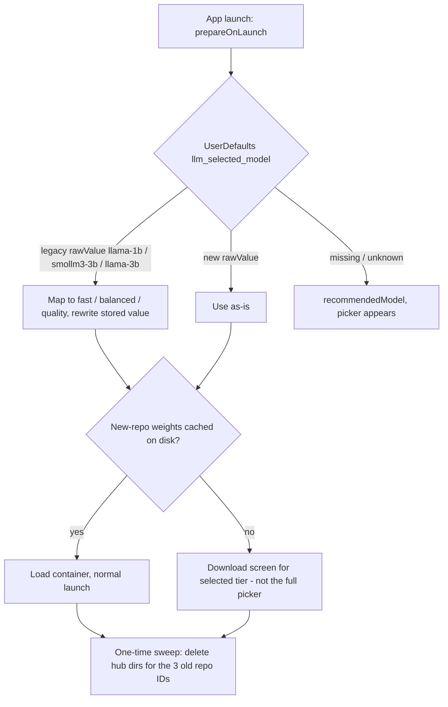

# Swap On-Device LLM Tiers to Gemma 3 / SmolLM3 4-bit - Plan

## Goal Capsule

- **Objective:** Replace the three user-selectable on-device LLM tiers in `Lifehug/Lifehug/App/ModelConfig.swift` with the verified 4-bit successors (Quality: Gemma 3 4B text, Fast: Gemma 3 1B QAT, Balanced: SmolLM3 3B 4-bit), migrate existing users safely, pass all build/test/archive gates, and ship TestFlight build 13.
- **Authority:** This plan > the ce-pov verdict memory > the goal's literal model strings. The goal named `gemma-3-4b-it-4bit`; research proved the text-only variant is strictly better (KTD1). Verified HuggingFace facts in this plan override remembered ones.
- **Execution profile:** All `xcodebuild`/`simctl` commands need the sandbox disabled and simulator `iPhone 17` (no iPhone 16 installed). Build from `Lifehug/` against `Lifehug.xcodeproj` explicitly — stale duplicate projects (`Lifehug 2`–`Lifehug 8.xcodeproj`) exist and must not be touched.
- **Stop conditions:** Stop and surface if any picked HuggingFace repo 404s at download time, if the Release archive raises Swift 6 concurrency errors that require redesigning the download/load path, or if TestFlight export fails for a reason other than the known teamID pitfall.
- **Tail ownership:** On-device 4B memory/latency/2-sentence validation is user-executed on iPhone 17 Pro via TestFlight build 13 (this Mac has no device). The degradation path is pre-decided (KTD8) so the follow-up is a one-line change.

---

## Product Contract

### Summary

Swap the app's three LLM tiers off Llama 3.2 / 3-bit SmolLM3 to newer 4-bit models with stronger instruction-following (IFEval: Gemma-3-4B-it 90.2 vs Llama-3.2-3B 77.4), which maps directly to the app's hard <200-char / 2-sentence reply constraint. Ship as TestFlight build 13 after a full-codebase code review.

### Problem Frame

The memoir interviewer's replies must stay under 2 sentences / ~200 chars (`LLMService.memoirInterviewerPrompt`); enforcement is prompt-only, so instruction-following quality is the product quality. Llama-3.2-3B is the weakest instruction-follower of the current options, and the Balanced tier runs a documented 3-bit false economy (SmolLM3-3B-3bit). The ce-pov verdict (2026-07-07) graded the switch "Trial": swap, but validate the 4B tier on-device before trusting it.

### Requirements

**Model swap**

- R1. Quality tier downloads and runs `mlx-community/gemma-3-text-4b-it-4bit` (~2599 MB).
- R2. Fast tier downloads and runs `mlx-community/gemma-3-1b-it-qat-4bit` (~771 MB).
- R3. Balanced tier downloads and runs `mlx-community/SmolLM3-3B-4bit` (~1747 MB).
- R4. The RAM-tier split is preserved: minimumRAM gates stay 4/6/8 GB by tier and `recommendedModel` thresholds stay 8 GB → Quality, 6 GB → Balanced, else Fast.
- R5. `diskSizeMB`, `displayName`, `description`, and `shortLabel` reflect the new models with the verified sizes above (decimal MB, matching the app's `/1_000_000` math).

**Migration and returning users**

- R6. A returning user keeps their tier selection across the swap (legacy persisted rawValues map to the same tier) and is routed to a download screen for the new model — never silently reset to the picker by surprise, never bricked.
- R7. Orphaned weights from retired repo IDs are swept once (~2 GB across the old Fast and Balanced dirs), keeping only the Quality revert asset until the device pass confirms the 4B tier (KTD8); Settings' Model Size row stays truthful for what remains.

**Output correctness**

- R8. Model special tokens never leak into saved answers or TTS speech: Gemma `<end_of_turn>`/`<start_of_turn>`, SmolLM3/Qwen `<|im_start|>`/`<|im_end|>`, and defensive `<think>`/`</think>`; existing Llama token stripping keeps working.
- R9. The Balanced tier answers directly, never emits reasoning: SmolLM3's chat template defaults to thinking mode, so the app appends `/no_think` to the instructions for that tier.

**Quality gates and release**

- R10. Simulator build (iPhone 17), the full test suite, and an unsigned Release archive (strict Swift 6 concurrency) all pass.
- R11. Build 13 uploads to TestFlight only after the full-codebase code review completes.
- R12. The `3d5fb60` DIAG `print()`s are retained (device pass still owed).
- R13. Project docs stop lying: CLAUDE.md's single-model "Llama 3.2 1B" line and iPhone 16 simulator examples are corrected.

### Scope Boundaries

**Deferred to Follow-Up Work**

- Pinning `mlx-swift-lm` to a revision instead of branch `main` (KTD6 carries the interim guard).
- SHA256 model verification (disabled today; `todos/036`, `todos/012`) — swapping repos re-trusts fresh downloads with the same known hole. Not made worse by this plan.
- LLM transcript-cleanup pass (polish raw speech into prose) — flagged in the verdict as a future feature for whichever model wins.
- Re-tuning `maxTokens = 150` and MemoryMonitor thresholds — measurement-gated on the device pass (KTD8).
- Sweeping the retained `models--mlx-community--Llama-3.2-3B-Instruct-4bit` directory once the device pass confirms the Quality tier (it is KTD8's revert asset until then — see U3).
- A code-side sentence-boundary trim before TTS as a hard guard for the 2-sentence constraint — even the chosen model misses length instructions ~10% of the time by its own IFEval score, and enforcement today is prompt-only. Judgment call on mid-reply truncation UX; evaluate for whichever model wins the trial.

**Outside this product's identity**

- Server-side or cloud LLM fallback. The pipeline stays fully on-device.

---

## Planning Contract

### Key Technical Decisions

- KTD1. **Quality = `gemma-3-text-4b-it-4bit`, not the goal's `gemma-3-4b-it-4bit`.** The named repo is multimodal (`vision_config` present, ~3439 MB): it loads via the text path but ships ~840 MB of vision weights the app discards. The text-only extract is the same 4B text tower at ~2599 MB, ungated, and verified loadable at the pinned `mlx-swift-lm` revision (`Gemma3Text.swift` unwraps `text_config`). Fallback stays `mlx-community/Qwen3-4B-Instruct-2507-4bit` (~2279 MB, non-thinking, verified).
- KTD2. **Fast = `gemma-3-1b-it-qat-4bit` over `gemma-3-1b-it-4bit` and `Qwen3-1.7B-4bit`.** QAT recovers near-bf16 quality at identical size (~771 MB). Qwen3-1.7B is rejected outright: it is a thinking model by default, and `<think>` output would consume the 150-token budget before any answer, with no `enable_thinking` control exposed through `ChatSession`.
- KTD3. **Keep the Balanced tier, with `/no_think` handling.** `mlx-community/SmolLM3-3B-4bit` exists, is ungated, and `smollm3` is registered at the pin — the "or drop the tier" arm is unnecessary. Dropping would strand 6 GB devices (iPhone 15/16 non-Pro) on Fast. Two template facts (fetched from the repo's `chat_template.jinja`): (a) thinking mode is ON by default — a plain system prompt yields a `<think>…</think>` block that would burn the 150-token budget and reach TTS; the template flips to direct answers when the literal string `/no_think` appears in the system message, so the app appends it for this tier only (R9). (b) The template calls `strftime_now(...)` — verified implemented in the pinned swift-jinja checkout (`Sources/Jinja/Globals.swift:21`), so rendering does not throw.
- KTD4. **Tier-stable persistence: rename enum cases/rawValues to `fast`/`balanced`/`quality` with a legacy-mapping getter.** Today's rawValues (`llama-1b`/`smollm3-3b`/`llama-3b`) encode model names that are now wrong. The `selectedModel` getter maps legacy strings to the same tier once; unknown strings keep falling back to `recommendedModel`. This survives any future model swap without another migration.
- KTD5. **Token cleaning: extend, don't replace.** `cleanResponse` hardcodes Llama's `<|eot_id|>`/`<|end_of_text|>` and `cleanChunk` only strips `<|`/`|>` pairs. File-verified token inventory per picked repo: Gemma tiers stop on `eos_token_id: [1, 106]` = `<eos>`/`<end_of_turn>`, and `<end_of_turn>`/`<start_of_turn>` are pipe-less — they sail through both cleaners and would be spoken by TTS. SmolLM3 stops on `<|im_end|>` (128012) and carries `<think>`/`</think>` (pipe-less — strip defensively even with R13's `/no_think`). Qwen fallback stops on `<|im_end|>`/`<|endoftext|>`. Add these named tokens to both cleaners rather than a broad `<[^>]+>` regex, so legitimate angle-bracket prose ("2 < 3") is never mangled.
- KTD6. **No `mlx-swift-lm` bump.** All needed model types (`gemma3`, `gemma3_text`, `qwen3`, `smollm3`) are registered at pinned revision `edd42fc`. The pin tracks branch `main`, so do not re-resolve packages during this work; a deliberate pin-to-revision is deferred follow-up.
- KTD7. **Ship from the current branch, upload gated on review.** Build 12 shipped from `fix/voice-pipeline-stt-tts-reliability`; build 13 continues that flow so one TestFlight build carries the voice fixes and the model swap for the owed device pass. The archive/upload unit (U7) runs only after the full-codebase code review completes.
- KTD8. **Degradation paths pre-decided, per tier, routed by failure mode.** Quality: a jetsam/memory failure reverts straight to `Llama-3.2-3B-Instruct-4bit` — a 320 MB weight reduction via Qwen would be marginal against MLX's documented runtime ballooning; a latency or reply-quality miss swaps to `Qwen3-4B-Instruct-2507-4bit` (~320 MB smaller, verified non-thinking). Balanced: reasoning leaks, empty replies, or jetsam reports from 6 GB devices revert to `SmolLM3-3B-3bit` (the shipped, known-fitting config). Fast: revert to `Llama-3.2-1B-Instruct-4bit`. Each arm is a one-line `ModelConfig` change plus size metadata. `maxTokens = 150` stays until the device pass measures Gemma/Qwen tokenization against the 2-sentence budget.

### Tier mapping

| Tier | Old repo (size MB) | New repo (size MB) | model_type | minimumRAM | recommendedRAM |
|---|---|---|---|---|---|
| Fast | Llama-3.2-1B-Instruct-4bit (700) | gemma-3-1b-it-qat-4bit (771) | gemma3_text | 4 GB | 4 GB |
| Balanced | SmolLM3-3B-3bit (1350) | SmolLM3-3B-4bit (1747) | smollm3 | 6 GB | 7 GB |
| Quality | Llama-3.2-3B-Instruct-4bit (1820) | gemma-3-text-4b-it-4bit (2599) | gemma3 (text_config, no vision) | 8 GB | 8 GB |

All three verified 2026-07-10 against the HuggingFace API: exist, `gated: false`, true 4-bit (group_size 64), instruct-tuned, and their `model_type` registered in `LLMModelFactory` at the pinned `mlx-swift-lm` checkout.

Chat-template facts (fetched from each repo's template files, 2026-07-10): both Gemma templates accept a system message by folding it into the first user turn (no exception path for system); SmolLM3 wraps the instructions in a metadata block and defaults to thinking mode (KTD3/R13); Qwen3-4B-Instruct-2507 takes a native system turn and is non-thinking.

### High-Level Technical Design

Returning-user launch flow after the swap (the migration seam U1 and U3 implement):

### Assumptions

- Work continues on `fix/voice-pipeline-stt-tts-reliability` (KTD7); no new branch or worktree.
- Device validation is user-executed via TestFlight build 13; this plan's done state for it is "protocol documented, degradation path pre-decided" (Operational Notes), not "validated".
- Sizes use decimal MB (bytes / 1e6) to match `diskSizeMB` consumers, including the disk-space preflight in `ModelDownloader.performDownload`.
- Simulator gates cannot exercise real inference (MLX is mocked on simulator), so template behavior verified from fetched template files above stands in for runtime proof until the device pass.

---

## Implementation Units

### U1. ModelConfig tier swap and selection migration

- **Goal:** New tiers wired with verified repo IDs, sizes, copy, and tier-stable persistence.
- **Requirements:** R1, R2, R3, R4, R5, R6
- **Dependencies:** none
- **Files:** `Lifehug/Lifehug/App/ModelConfig.swift`, `Lifehug/Lifehug/App/ModelState.swift`, `Lifehug/Lifehug/Views/LaunchView.swift`, `Lifehug/LifehugTests/ModelConfigTests.swift` (new)
- **Approach:** Rename cases to `fast`/`balanced`/`quality` (rawValues match, KTD4). Update `huggingFaceID` to the three picks, `diskSizeMB` to 771/1747/2599, `displayName`/`description`/`shortLabel` to Gemma/SmolLM3 copy. Keep `minimumRAM`/`recommendedRAM`/`recommendedModel` thresholds unchanged (R4). In the `selectedModel` getter, map legacy rawValues (`llama-1b`→`fast`, `smollm3-3b`→`balanced`, `llama-3b`→`quality`) and rewrite the stored value; audit `hasSelectedModel` so a legacy string counts as selected. Wire the launch path so the migrated tier survives to the download screen: `LaunchView`'s `selectedModel` @State (line ~7, currently unconditionally `recommendedModel`) seeds from `ModelConfig.LLM.selectedModel` when `hasSelectedModel` is true, and `ModelState.prepareOnLaunch` reads `selectedModel` (firing the legacy mapping) on the no-cached-model path — otherwise a Fast-tier user on an 8 GB device gets silently switched to a 2.6 GB Quality download when their old weights stop matching.
- **Patterns to follow:** Existing switch-per-property shape in `ModelConfig.swift`; Swift Testing style used across `LifehugTests`.
- **Test scenarios:**
  - Each legacy rawValue maps to the same tier and persists the new rawValue.
  - Unknown/garbage stored string falls back to `recommendedModel` (existing behavior preserved).
  - New rawValues round-trip through `selectedModel` get/set.
  - `huggingFaceID` returns exactly the three verified repo strings.
  - `diskSizeMB` and `downloadSizeLabel` match the new sizes ("2.6 GB download" for quality).
  - RAM gates monotonic: fast ≤ balanced ≤ quality for both minimum and recommended.
  - A returning user with a legacy rawValue and no cached new-repo weights gets a download screen preselected to their own mapped tier, not the RAM-recommended one.
- **Verification:** `ModelConfigTests` green; picker renders three cards with new names on simulator; download screen preselects the persisted tier for a returning user.

### U2. Special-token stripping and per-model prompt handling in LLMService

- **Goal:** No template token ever reaches saved answers or TTS, and the Balanced tier answers directly instead of reasoning.
- **Requirements:** R8, R9
- **Dependencies:** U1 (tier cases referenced by the `/no_think` condition)
- **Files:** `Lifehug/Lifehug/Services/LLMService.swift`, `Lifehug/LifehugTests/LLMServiceTests.swift`
- **Approach:** Extend `cleanResponse` (currently Llama-only at ~296-297) and the streaming `cleanChunk` (strips only `<|`…`|>` at ~285-286) with the file-verified tokens from KTD5: `<end_of_turn>`, `<start_of_turn>` (and role suffixes like `<start_of_turn>model`), `<think>`/`</think>`, plus explicit `<|im_start|>`/`<|im_end|>` in `cleanResponse` (pipe-stripping may already cover these in `cleanChunk` — pin with tests). The two cleaners get different semantics: `cleanResponse` removes the entire `<think>…</think>` block including inner content (bounded, non-greedy match on the exact tags — token replacement alone would leave the reasoning text in saved output), while the streaming `cleanChunk` strips only the named tag tokens; cross-chunk reasoning suppression is R9's `/no_think` job, not the cleaner's. Apply the Balanced-tier `/no_think` append at every ChatSession creation site — centralize instruction-building in one helper used by `startNewSession`, `ensureSession`, and `generateLongResponse` (~251-255), or chapter generation keeps thinking through its 300-800 token budgets. Leave the Gemma/Qwen prompt untouched. Fix the stale "only one Llama container" comment at `LLMService.swift:30` while in the file (R13 adjacent).
- **Execution note:** Write the failing cleaner tests first — the leak is invisible on simulator (MLX mocked), so tests are the only pre-device proof.
- **Test scenarios:**
  - Response ending in `<end_of_turn>` saves clean text.
  - Streamed chunks containing `<start_of_turn>model` emit nothing token-shaped.
  - `<think>reasoning</think>answer` yields only the answer.
  - Existing `<|eot_id|>`/`<|end_of_text|>` stripping still passes.
  - Prose containing a bare `<` or "2 < 3" is untouched.
  - Instructions sent for the Balanced tier end with `/no_think`; Fast/Quality instructions do not contain it.
  - Long-form (chapter-generation) instructions also carry `/no_think` on the Balanced tier.
  - Prompt-pinned substrings "text-to-speech" and "200 characters" still present (`LLMServiceTests.swift:43-44` guard).
- **Verification:** `LLMServiceTests` green including new cases.

### U3. One-time orphaned-model sweep

- **Goal:** Retired Llama-1B/SmolLM3-3bit weights (~2 GB combined) don't strand on returning users' devices, while the Quality revert asset survives the trial window.
- **Requirements:** R7
- **Dependencies:** U1 (new IDs must be final so the sweep never deletes a current model)
- **Files:** `Lifehug/Lifehug/Services/ModelDownloader.swift`, `Lifehug/LifehugTests/ModelDownloaderTests.swift` (extend or create)
- **Approach:** On launch (from `prepareOnLaunch`'s path), delete hub directories matching only two exact old repo IDs (`models--mlx-community--Llama-3.2-1B-Instruct-4bit`, `models--mlx-community--SmolLM3-3B-3bit`) under `models/huggingface/hub`. `models--mlx-community--Llama-3.2-3B-Instruct-4bit` is deliberately NOT swept in build 13 — it is KTD8's Quality revert asset, and deleting it in the same build that runs the trial would force every Quality-tier user to re-download ~1.8 GB if the revert fires; its sweep is deferred follow-up after the device pass confirms Quality. Explicit allowlist — not "anything outside `allCases`" — so an unexpected dir is never destroyed. Reuse the dir-name mapping (`/`→`--`) from `cachedModelOption`.
- **Test scenarios:**
  - Allowlisted old dirs present → removed; current-model dir untouched.
  - The retained `Llama-3.2-3B-Instruct-4bit` dir is NOT removed.
  - No old dirs → no-op, no error.
  - Sweep is idempotent across launches.
  - Mixed state (one allowlisted old + one new dir) → only the allowlisted old removed.
- **Verification:** Tests green; after the sweep, Settings' Model Size row reflects only the live model.

### U4. Hardcoded model-name sweep in UI and comments

- **Goal:** No stray "Llama"/"SmolLM 3-bit" strings contradict the new tiers.
- **Requirements:** R5, R13
- **Dependencies:** U1
- **Files:** `Lifehug/Lifehug/Views/LaunchView.swift`, `Lifehug/Lifehug/Views/SettingsView.swift`, any other grep hits for `Llama`/`SmolLM` in `Lifehug/Lifehug/`
- **Approach:** The picker and settings render from `ModelConfig` computed properties, so most copy updates land via U1 — this unit is the grep-and-fix residue (comments, previews, string literals).
- **Test expectation:** none — copy and comments only; rendering is covered by U1's verification.
- **Verification:** `grep -ri "llama\|smollm" Lifehug/Lifehug/` returns only intentional hits (e.g., legacy-mapping strings in ModelConfig and the U3 allowlist).

### U5. Docs refresh

- **Goal:** CLAUDE.md matches reality.
- **Requirements:** R13
- **Dependencies:** U1 (names final)
- **Files:** `CLAUDE.md`
- **Approach:** Replace the stale "Llama 3.2 1B (MLX)" line with the three-tier Gemma/SmolLM3 description; change build/test example destinations from iPhone 16 to iPhone 17.
- **Test expectation:** none — documentation.
- **Verification:** CLAUDE.md names the three shipped tiers and a simulator that exists on this Mac.

### U6. Build number bump to 13

- **Goal:** Release identity for the TestFlight upload.
- **Requirements:** R11
- **Dependencies:** U1-U5 complete and gates green
- **Files:** `Lifehug/Lifehug.xcodeproj/project.pbxproj` (`CURRENT_PROJECT_VERSION` in both Debug and Release configs, currently 12 at lines ~625/648)
- **Approach:** Follow the established release workflow; commit as `chore: Bump build number to 13 for TestFlight`.
- **Test expectation:** none — build metadata.
- **Verification:** Both configs read 13; archive embeds build 13.

### U7. Archive and TestFlight upload (gated on code review)

- **Goal:** Build 13 on TestFlight carrying the model swap plus the voice-pipeline fixes, enabling the owed device pass.
- **Requirements:** R11, R12
- **Dependencies:** U6, plus the full-codebase code review pass (external gate per KTD7)
- **Files:** none in-repo (archive + `ExportOptions.plist` at `$TMPDIR`)
- **Approach:** `xcodebuild archive` (no signing flags) then `-exportArchive` with `method=app-store-connect`, `destination=upload`, `teamID=PJHS9XQS6H` (the distribution-cert team — not the dev team, per `docs/solutions/deployment-issues/xcodebuild-export-archive-wrong-team-id.md`), `signingStyle=automatic`, `-allowProvisioningUpdates` and the globally configured Admin ASC API key. DIAG prints stay in (R12).
- **Test expectation:** none — release execution; gates are the Verification Contract.
- **Verification:** Upload accepted by App Store Connect; build 13 appears in TestFlight processing.

---

## Verification Contract

All commands run from `Lifehug/`, target `Lifehug.xcodeproj` explicitly, use the iPhone 17 simulator, and need the command sandbox disabled (CoreSimulator/DerivedData/SPM restrictions). Do not re-resolve SwiftPM packages during this work (KTD6).

| Gate | Command shape | Proves |
|---|---|---|
| Pin check | grep the workspace `Package.resolved` for mlx-swift-lm revision `edd42fcd947eea0b19665248acf2975a28ddf58b` before each archive gate | The verified-at-pin facts (model-type registry, `text_config` unwrap, `strftime_now`) still hold — the pin tracks branch `main` and a silent re-resolve invalidates them |
| Build | `xcodebuild build -project Lifehug.xcodeproj -scheme Lifehug -destination 'platform=iOS Simulator,name=iPhone 17'` | Compiles under Debug |
| Tests | `xcodebuild test` (same destination) | Full suite (117+ incl. new U1/U2/U3 tests) green |
| Concurrency gate | `xcodebuild archive ... CODE_SIGNING_ALLOWED=NO CODE_SIGNING_REQUIRED=NO` | Strict Swift 6 Release concurrency — the gate Debug misses |
| Download smoke | Before U7: launch the app on the iPhone 17 simulator and start a download for each of the three new repo IDs (`ModelDownloader` has no simulator short-circuit) | The shipped `huggingFaceID` strings actually resolve on HuggingFace — a wrong slug would otherwise brick users at download time, a failure mode `docs/solutions/` records |
| Release | U7's signed archive + export/upload | Build 13 reaches TestFlight |

The simulator proves compilation and unit tests only — `LLMService`/`ModelState` short-circuit to mocks on simulator, so no gate here exercises Gemma/SmolLM3 inference. Real-model behavior lands in the Operational Notes device protocol.

---

## Definition of Done

- All of R1-R13 satisfied; U1-U7 landed as focused commits on `fix/voice-pipeline-stt-tts-reliability`.
- All Verification Contract gates green; no new warnings on touched files in the Release archive.
- Full-codebase code review completed before the U7 upload; review findings either fixed or explicitly deferred with reasons.
- Build 13 visible in TestFlight.
- On-device validation protocol below handed off (user-executed); degradation path (KTD8) documented so the follow-up is one line.
- No abandoned experiments left in the diff; DIAG prints from `3d5fb60` untouched.

---

## Operational Notes — on-device validation protocol (build 13, iPhone 17 Pro)

User-executed via TestFlight; this is the "Trial" gate from the ce-pov verdict:

1. **Memory:** Per tier, run a full voice session (WhisperKit STT + LLM + Kokoro TTS co-loaded). Watch for jetsam kills, especially Quality (4B ≈ 2.5 GB weights + KV cache). MLX's Metal memory management has previously ballooned a 300 MB model to 2.3 GB runtime (see `docs/solutions/ios-audio-pipeline/mlx-kokoro-crash-and-apple-stt-cutoff.md`) — treat peak memory as the primary risk.
2. **Latency:** First-token and full-reply latency per tier; a larger model widens the just-fixed load race window, so confirm "await model-ready before generating" holds (no "Something went wrong" on first question).
3. **Instruction-following and reply quality:** Confirm replies actually obey the 2-sentence/<200-char rule (the reason for this swap) and that no template tokens are spoken (R8 on real weights). Per tier, compare 5-10 interviewer replies against build 12's Llama replies for warmth and question quality — build 12 is still on TestFlight as the baseline — and treat a reply-quality regression as a KTD8 trigger alongside jetsam and latency.
4. **Token budget:** Check `maxTokens = 150` doesn't mid-sentence-truncate Gemma output (tokenizer differs from Llama); re-tune only with measurements in hand.
5. **Failure → degradation:** When any check fails on build 13, re-run the same scenario on build 12 first to separate model-swap effects from the voice-pipeline fixes, then apply KTD8's per-tier, failure-mode-routed arms rather than tuning under pressure.
6. **Coverage limit:** The 4 GB and 6 GB minimum-RAM gates are unvalidated by this pass — an iPhone 17 Pro exceeds every tier's minimum. Balanced grew ~30%, and the outgoing 3-bit model was already annotated "Tight on 6 GB"; watch for jetsam reports from 6 GB testers (iPhone 15/16 non-Pro) and route them to KTD8's Balanced arm.

---

## Sources & Research

- ce-pov verdict (2026-07-07): IFEval Gemma-3-4B-it 90.2 > Qwen3-4B-Instruct-2507 83.4 > Llama-3.2-3B 77.4; SmolLM3 3-bit false economy; "Trial" grade requiring device validation.
- HuggingFace API verification (2026-07-10): all eight candidate repos checked for existence, gating, `model_type`, quantization, and exact safetensors sizes; picks in Tier mapping table.
- `mlx-swift-lm` pinned checkout `edd42fc` (`Package.resolved` + DerivedData source): `LLMModelFactory` registers `gemma3`, `gemma3_text`, `qwen3`, `smollm3`; `Gemma3Text.swift` unwraps `text_config` and discards vision weights; `ChatSession` applies the repo tokenizer chat template.
- Code map: `ModelConfig.swift` (all tier metadata + persistence), `ModelDownloader.swift` (disk layout `models--<org>--<name>`, disk preflight at ~182, whole-dir-only delete at ~234-247), `ModelState.swift:44-56` (launch auto-detect that causes the returning-user bounce), `LLMService.swift` (~285-297 cleaners, 54 maxTokens, 30 stale comment), `LaunchView.swift:82-133`, `SettingsView.swift:48-57/364-392`.
- `docs/solutions/deployment-issues/xcodebuild-export-archive-wrong-team-id.md` (teamID pitfall), `docs/solutions/ios-audio-pipeline/mlx-kokoro-crash-and-apple-stt-cutoff.md` (MLX memory ballooning, wrong-model-ID 404 bricking).
- Known hole carried, not fixed: model "verification" is just a successful container load; SHA256 checks disabled (`todos/036`, `todos/012`).
