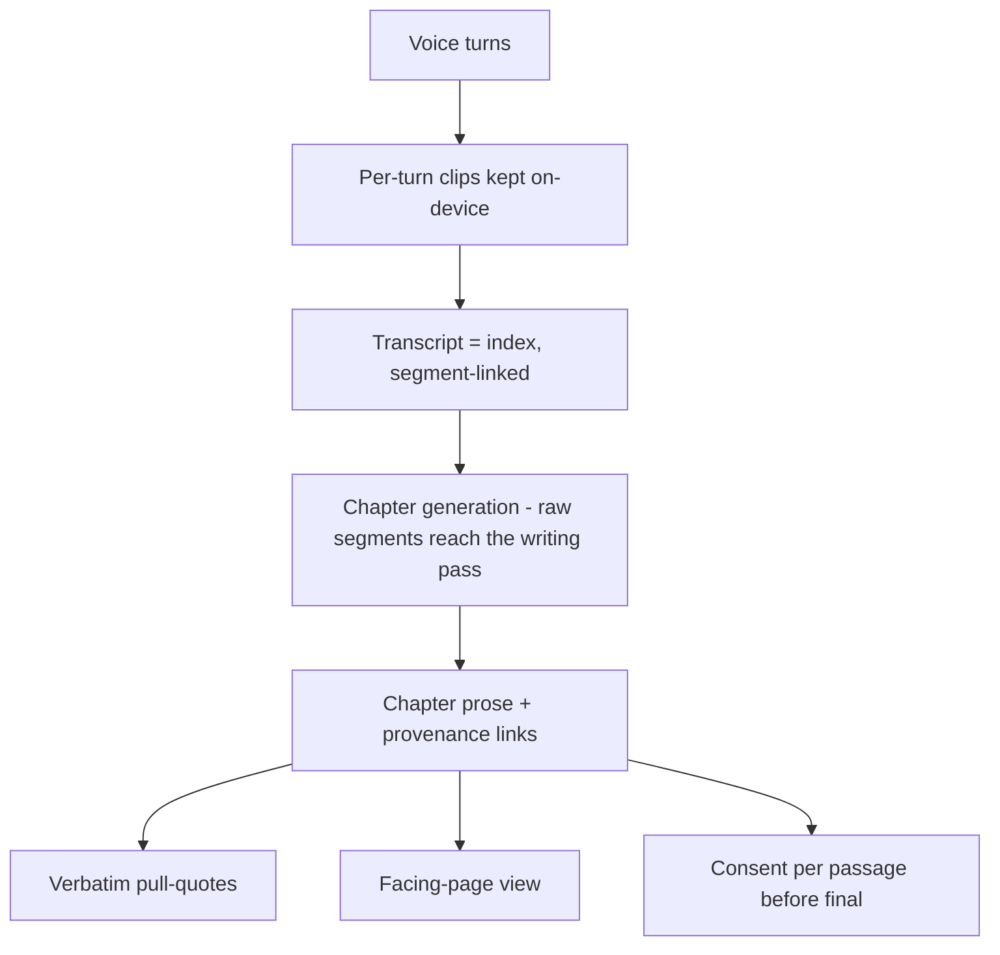
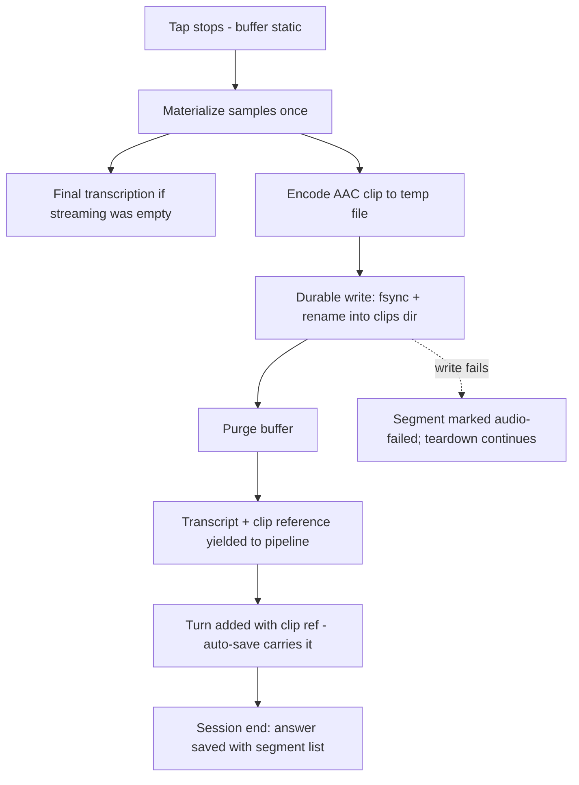
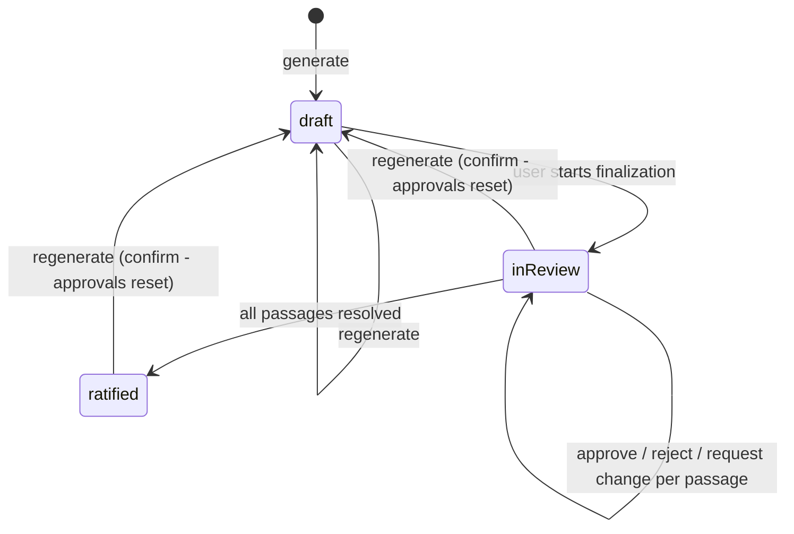

# Keep the Voice and Verbatim Provenance - Plan

## Goal Capsule

- **Objective:** Make the person's actual voice and actual words durable: every answer's audio is kept as the permanent record, and raw words travel traceably through chapter generation into verbatim quotes, a facing-page reading view, and a consent flow for final chapters.
- **Product authority:** Mitch; source ideation is `docs/ideation/2026-07-11-open-ideation.html` (ideas 2 and 3). Product Contract confirmed 2026-07-11; plan scope confirmed same day (six call-outs accepted, including re-answer clip deletion and regeneration resetting approvals).
- **Execution profile:** Two shippable phases — Phase A (audio durability, U1-U8) can land and ship before Phase B (provenance and consent, U9-U12). Within a phase, follow unit dependency order.
- **Stop conditions:** Surface instead of guessing if implementation contradicts the render-thread constraint (no locks on the audio render thread), the teardown ordering in `Lifehug/Lifehug/Services/STTService.swift`, or requires changing Product Contract behavior. Simulator cannot exercise real capture (STT is mocked there) — do not claim capture verification from simulator runs.
- **Open blockers:** None. Three owed perf-review findings touch the same STT file (timeout enforcement, WhisperKit load bound, teardown await); coordinate if they land concurrently, but they do not block this plan.

---

## Product Contract

### Summary

Persist each voice answer's recordings on-device as the answer's canonical record, with the transcript demoted to an index over the audio. Thread the raw answer text, segment-linked, through all of chapter generation so chapters carry verbatim pull-quotes, a facing-page verbatim/prose view, and a per-passage consent flow before a chapter becomes final.

### Problem Frame

Today the most valuable thing the app captures is deleted after one read: audio exists only in the speech recognizer's buffer and is purged at the end of every recording. An empty transcript is therefore permanent data loss — the project's most-fought failure class. Separately, chapter generation discards the person's raw words after its first pass, so the writing pass's instruction to "use their own words" is unsatisfiable as written. The category's most-repeated competitor complaint is prose that "doesn't feel like their real voice"; Lifehug currently has no mechanism to avoid the same fault.

### Key Decisions

- **The recording is the record.** Full persistence over the recovery-only alternative (keep audio just until a good transcript exists). Permanence makes empty transcripts recoverable by construction and is the prerequisite for any future hear-it-in-their-voice feature.
- **An answer's audio is an ordered sequence of per-turn clips, not one file.** Answers compile from multiple spoken turns, each capped at 180 seconds, so playback and storage follow the clip-sequence shape. Segments without audio are valid (typed turns, simulator sessions, failed clip writes).
- **Transcript becomes an index.** Each clip links to the turn text derived from it; re-transcription replaces index text, never audio, and only for segments still flagged as needing transcription — it never overwrites user-edited or populated text.
- **Full provenance stack ships together.** Segment-linked raw text through generation, verbatim pull-quotes in chapters, the facing-page view, and the consent flow — chosen over schema-only or pull-quotes-only cuts.
- **Consent guards final chapters only.** Interim drafts and auto-generated payoffs (see `docs/plans/2026-07-11-003-feat-humane-interviewer-chapter-payoff-plan.md`) are labeled drafts and exempt. Regenerating a chapter that has approved passages requires explicit confirmation and resets all passage approvals.
- **No automatic deletion of memoir audio.** Storage grows roughly 0.25MB per recorded minute at the chosen encoding; usage is visible to the user, and deletion is always an explicit user act. Re-answering a question deletes the previous answer's clip set as one explicit, gated step.
- **Editing keeps the audio.** Editing a voice answer's text marks the affected segments user-edited; their audio is kept, they drop out of verbatim pull-quote eligibility, and the facing-page view shows the original transcript with an edited badge.
- **Existing text-only answers stay text-only.** No backfill is possible; the lenient-parse precedent in the answer format covers coexistence.

### Requirements

**Audio capture and retention**

- R1. Every voice turn's audio is persisted on-device as part of the answer's record, as an ordered sequence of per-turn clips.
- R2. Each clip links to the transcript text derived from it, and the answer's compiled text remains derivable from its clip-linked segments; segments without a clip (typed turns, failed writes) are valid.
- R3. An empty or failed transcription no longer loses the answer: the audio survives, the answer is saved in an audio-only state and flagged, and it can be re-transcribed later (automatic retry or user-initiated).
- R4. The answer browser can play an answer's clips in order.
- R5. Audio inherits the answer record's on-device protections: file protection set per clip at write time, and exclusion from iCloud backup when the user has backup disabled.
- R6. Deleting an answer deletes its audio; the user can also delete audio alone, leaving the text answer.
- R7. Total audio storage usage is visible in settings; the app never deletes memoir audio automatically.
- R8. Existing text-only answers remain fully valid without audio.
- R9. Persisting audio must not degrade live capture: no locks are added on the audio render thread, and the existing stop-tap-then-read teardown ordering is preserved.

**Verbatim provenance**

- R10. The chapter-writing pass receives segment-linked raw answer text, so "use their own words" is satisfiable rather than aspirational.
- R11. Each generated chapter stores provenance: links from its passages to the source answer segments they came from, kept beside the chapter.
- R12. Chapters include verbatim pull-quotes drawn from linked segments, visually marked as the person's exact words; a quote that does not match its source exactly is omitted, never approximated.
- R13. A facing-page view lets a reader see chapter prose alongside the verbatim source it was written from.
- R14. Before a chapter becomes final, the person reviews it passage by passage and approves, rejects, or requests a change; unapproved passages are visibly flagged.
- R15. Consent applies only at chapter finalization; interim drafts are labeled as drafts and carry no ratification state.

### Key Flows

- F1. **Voice answer with kept audio.**
  - **Trigger:** User finishes a spoken turn in a session.
  - **Steps:** Turn audio is persisted as a clip during recording teardown; the finalized transcript carries the clip reference into the session turn; at session end the answer saves with its clip sequence and segment links.
  - **Covers:** R1, R2, R9.
- F2. **Empty-transcript recovery.**
  - **Trigger:** Transcription returns empty for a turn with real audio.
  - **Steps:** Clip is kept; answer saves audio-only and flagged; re-transcription runs on retry or next launch; index text fills in when it succeeds, only for still-flagged segments.
  - **Covers:** R3.
- F3. **Chapter generation with provenance.**
  - **Trigger:** Chapter generation runs for a category.
  - **Steps:** Generation consumes segment-linked raw answers; output draft carries passage-to-segment links and marked verbatim pull-quotes, computed by matching prose against source text.
  - **Covers:** R10, R11, R12.
- F4. **Consent at finalization.**
  - **Trigger:** User finalizes a chapter for the book.
  - **Steps:** Passage-by-passage review; approve / reject / request change; chapter marked ratified only when every passage is resolved.
  - **Covers:** R14, R15.

### Acceptance Examples

- AE1. **Covers R3.** Given a turn whose transcription is empty, when the session ends, then the answer exists with playable audio and a "needs transcription" flag, and no audio was deleted.
- AE2. **Covers R8.** Given an answer created before this feature, when it is viewed or edited, then it behaves exactly as today, with no audio affordances and no migration error.
- AE3. **Covers R2.** Given a re-transcription of an existing clip, when it completes, then the linked index text is replaced only if the segment is still flagged, and the clip is untouched.
- AE4. **Covers R15.** Given an auto-generated interim draft, when it is surfaced, then it is labeled a draft and no consent prompt appears.
- AE5. **Covers R6.** Given a voice answer, when the user deletes its audio alone, then the text answer remains, its segments show no playback affordance, and storage usage drops accordingly.
- AE6. **Covers R14.** Given a ratified chapter, when the user asks to regenerate it, then a confirmation names that approvals will reset, and on confirm the new draft starts with all passages unresolved.
- AE7. **Covers R6, R7.** Given a question with a saved voice answer, when the user re-answers and saves, then a confirmation first names that the previous answer's recording will be permanently deleted, and only on confirm does the new clip set commit and the old set delete.

### Scope Boundaries

- **Deferred for later:** hear-it-in-their-voice playback inside chapters, the queryable conversational archive (ideation R7), audio export/sharing, per-sentence audio alignment finer than clip-level, an ALAC lossless recording tier, background (BGProcessingTask) retry draining beyond launch replay.
- **Out:** any cloud sync or upload of audio; automatic audio cleanup or quotas; backfilling audio for pre-feature answers.

### Dependencies / Assumptions

- No consistent user exists yet; acceptance is Mitch's own judgment at testing time (build-first decision).
- Storage cost at AAC encoding is roughly 0.25MB per recorded minute; R7's visibility is the safety valve instead of a cap.
- Answers are markdown files today; clip references become first-class, round-tripped answer fields, and audio lives as sibling files. Existing one-time-migration precedents in the codebase cover the format evolution.
- Competitive framing (verbatim trust as the category fault line) is category-level evidence, not observed Lifehug-user evidence.

### Sources / Research

- `docs/ideation/2026-07-11-open-ideation.html` — ideas 2 and 3, basis-verified.
- Verified against working tree 2026-07-11: answer model stores text only (`Lifehug/Lifehug/Models/Answer.swift:11`); single audio purge site after tap stop (`Lifehug/Lifehug/Services/STTService.swift:355`); no audio-file writes exist anywhere in the app; the writing pass receives only bullets and outline (`Lifehug/Lifehug/Services/ChapterGenerator.swift:142-158`); answers compile from multiple turns (`Lifehug/Lifehug/App/SessionState.swift:27-30`) with a 180s per-turn cap (`Lifehug/Lifehug/Services/STTService.swift:61`).
- Render-thread constraint: `CLAUDE.md` Known Issues — no locks on the audio render thread.
- WhisperKit is the `Reebz/WhisperKit` fork pinned at `aed3b1c` (see `Lifehug/Lifehug.xcodeproj/project.xcworkspace/xcshareddata/swiftpm/Package.resolved`); its single-result `transcribe` overloads are deprecated — use the array-returning forms. `AudioProcessor.audioSamples`, `loadAudioAsFloatArray`, and `transcribe(audioPath:)` are current.
- Anchoring model: W3C Web Annotation selectors (TextQuoteSelector + TextPositionSelector), exact-then-fuzzy resolution as used by Hypothesis and Google LangExtract.
- Prior institutional learning: `docs/solutions/ios-audio-pipeline/mlx-kokoro-crash-and-apple-stt-cutoff.md` — STT half is stale (Parakeet-era) but the TTS/AVAudioPlayer double-resume guard and await-actor-setup rules still hold.

---

## Planning Contract

**Product Contract preservation:** unchanged in substance. One clarification: R5's protection wording is implemented with a per-clip protection class that survives device lock during the teardown write (KTD4) rather than the answers directory's stricter class; backup behavior is exactly as R5 states.

### Key Technical Decisions

- KTD1. **Clip format: AAC-LC mono in `.m4a`, written by `AVAudioFile` at 16kHz, ~32kbps.** Matches the 16kHz mono Float32 source (no resample, no converter), ~240KB/min, natively encodable and decodable, and what voice-memo-class apps ship. Opus rejected — no reliable first-party iOS encoder; raw WAV rejected — 4x size for no fidelity gain over the band-limited source. Buffers are written in the file's `processingFormat` (Float32) in chunks; a 180s clip is ~2.88M frames and must not be written as one buffer.
- KTD2. **Persist point: inside `finishRecording`'s guarded teardown window — durability now, encoding later.** After `stopStreamTranscription()` (buffer static), inside the `sessionID == self.sessionID` guard, before `purgeAudioSamples(keepingLast: 0)`: the clip write materializes the buffer itself (`Array(processor.audioSamples)`, ~11.5MB — a cost now paid on every recorded turn, not just the rare empty-streaming path) and synchronously writes the raw samples to the session's staging area. That raw dump is the durability point and completes before `stopAndWait()` returns. On the empty-streaming path, final transcription reuses the same materialized array — sharing runs from the clip write to final transcription, not the reverse (the normal path never materialized the buffer before this feature). AAC encoding, full-fsync, and the atomic replacement of the raw dump with the `.m4a` run off the teardown path after the transcript yields, so encode time never delays the LLM response. A persist failure never blocks the purge or the transcript yield — the segment is marked audio-failed instead.
- KTD3. **One durable-write helper, used three ways.** Write to a temp URL, `F_FULLFSYNC` the descriptor, then atomic rename (`FileManager.replaceItemAt` when replacing). Reused for clips, provenance sidecars, and the retry-queue file. File protection and backup-exclusion flags are set per file at write time — the existing launch-time `setupDirectories()` pass is not sufficient for files created later (the auto-save code already re-sets flags per write for exactly this reason). This applies to every file this plan writes: clips, provenance sidecars, the retry-queue file, and consent records. The provenance sidecar carries verbatim speech, so it gets the same protection class and user-gated backup exclusion as clips.
- KTD4. **Clip protection class: `.completeUnlessOpen`.** A clip being written when the device locks must finish writing; `.completeFileProtection` would fail that write. Reads are foreground-only in this plan, so the relaxed class costs nothing. Answers keep their existing class.
- KTD5. **Clips follow the user's `iCloudBackupEnabled` setting, like other user data.** They are not always-excluded like model files: recordings are irreplaceable, models are re-downloadable. Backup-exclusion flags are re-asserted after file operations that can reset them.
- KTD6. **Segment and clip references are first-class `Answer` fields, round-tripped through `toMarkdown()`/`fromMarkdown()`.** A new `## Voice Clips` section after the second `---` separator (mirroring the follow-up-questions section pattern), one line per segment: clip filename (or none), per-segment source (voice/text), edited flag, needs-transcription flag. Anything not round-tripped is stripped by the existing edit path (`AnswerDetailView` rebuilds the struct), so sidecar-only links die on first edit. Old files parse unchanged (lenient parse defaults the section to absent).
- KTD7. **Clip identity: session-staged, committed on save.** Each recording session writes its clips into a staging subdirectory keyed by a fresh recording-session UUID; filenames are `<questionID>-<recordingUUID>-<turnIndex>.m4a`, where turnIndex counts user turns only (matching the compiled answer's segment order), guarded by the same path-safety regex as answer filenames. Clips move from staging into the clips directory only when the answer save succeeds, so a same-pass re-answer never overwrites the prior answer's audio mid-session, and an abandoned re-answer leaves the prior answer's clips intact. `SaveableTurn` and the auto-save payload carry the clip reference — the in-memory turn UUID is regenerated on restore and must not key anything persistent.
- KTD8. **Edit rule.** Editing answer text marks affected segments user-edited; audio is kept; edited segments are excluded from verbatim pull-quote eligibility; re-transcription fills only segments still flagged needs-transcription and never overwrites populated or edited text.
- KTD9. **Re-answer contract.** Replacing a question's answer commits the new session's staged clips and deletes the prior clip set as one explicit step gated behind the save action — never as an implicit side effect of the file overwrite. The save is preceded by a confirmation naming that the previous answer's recording will be permanently deleted, mirroring the regeneration confirmation. Abandoned staging directories are cleaned by launch reconciliation.
- KTD10. **Re-transcription uses the fork's `transcribe(audioPath:)` (array-returning).** Decode options and the sanitize/join helpers mirror the existing final-transcription path so re-transcribed text is indistinguishable from live text. Retry state is a small Codable JSON queue in Application Support (durable-write helper, idempotent enqueue by clip key), replayed on launch plus a manual retry action; attempts are bounded, then the segment moves to a needs-attention state. Clip lifetime is independent of transcription success.
- KTD11. **Playback: a standalone clip player routed through `AudioSessionController`.** `AVQueuePlayer` for ordered clip sequences, interruption handling via the session-interruption notification path the controller owns. The browser runs outside any pipeline, so playback activates the session itself (`beginPlaybackPhase()`), respects the `recordEpoch` stale-deactivation guard, and refuses to start while a recording session is live. Do not reuse `KokoroManager` — its player is private and entangled with TTS engine state; mirror its delegate/double-resume-guard shape instead.
- KTD12. **Provenance is computed post-hoc, never trusted from the model.** The on-device 1B tier cannot reliably emit structured anchors or exact substrings. After Pass 3, prose passages are matched against source segments: W3C dual selector per link (TextQuoteSelector exact+prefix+suffix, plus TextPositionSelector offsets), exact match first, then normalized fuzzy match (Unicode NFC, collapsed whitespace, similarity threshold ~0.85), with a recorded match status (exact/fuzzy/none). No confident match means no link and no pull-quote — never a wrong one. Each link stores a content hash of its source segment so staleness is detectable.
- KTD13. **Provenance lives in a per-chapter sidecar JSON** (`drafts/chapter-<Letter>.provenance.json`, schema-versioned, regenerable). Chapter markdown stays headerless prose (the human artifact); the sidecar is the machine artifact; independent write paths keep their failure modes separate. The sidecar carries the person's verbatim words, so it is written with the clips' protection class and honors the user's backup-exclusion setting (the drafts directory gets neither today), and deleting an answer or its audio prunes the sidecar entries and pull-quotes sourced from it (U7).
- KTD14. **Pass 3 receives budgeted raw text, not everything.** Only segments referenced by the current outline section, under a hard character budget, with the extract-bullets pipeline unchanged — raw text supplements bullets rather than replacing them, so the smallest model tier's context window still fits.
- KTD15. **Chapter consent is a small persistent record with a state machine:** draft → in-review → ratified, per category, stored beside the draft. Regenerating a chapter with any approved passage requires explicit confirmation and resets all passages to unresolved (anchors move with the prose).
- KTD16. **Canonical writes throw and surface.** Clip, sidecar, and consent-record write failures are surfaced to the user — the existing "save failed silently for now" pattern is not inherited for audio or provenance (a dropped recording is unrecoverable).

### High-Level Technical Design

Capture data flow (Phase A):

Chapter consent state machine (Phase B):

Sequencing: U1 → U2 → U3 → U4 → {U5, U6, U7} → U8 completes Phase A (U8's orphaned-clip count consumes U7's reconciliation output); U9 → U10 → {U11, U12} completes Phase B. U9 depends only on U4's segment model and can start alongside U5-U7.

---

## Implementation Units

| U-ID | Title | Key files | Depends on |
|---|---|---|---|
| U1 | Durable write foundation + clips directory | `Services/StorageService.swift` | — |
| U2 | AAC clip encoder/store | `Services/AudioClipStore.swift` (new) | U1 |
| U3 | Capture hook in STT teardown | `Services/STTService.swift`, `Pipeline/VoicePipeline.swift` | U2 |
| U4 | Segment data model through answer save | `Models/Answer.swift`, `App/SessionState.swift`, views | U3 |
| U5 | Recovery flag + retry queue | `Services/TranscriptionRetryQueue.swift` (new), `Services/STTService.swift` | U4 |
| U6 | Clip playback | `Services/AudioClipPlayer.swift` (new), `Services/AudioSessionController.swift`, `Views/AnswersBrowserView.swift` | U4 |
| U7 | Delete flow, re-answer contract, reconciliation | `Services/StorageService.swift`, `Views/AnswersBrowserView.swift` | U4 |
| U8 | Storage usage row | `Views/SettingsView.swift` | U1, U7 |
| U9 | Anchor engine | `Services/ProvenanceAnchor.swift` (new) | U4 |
| U10 | Generator provenance + sidecar | `Services/ChapterGenerator.swift`, `Views/AnswersBrowserView.swift` | U9 |
| U11 | Chapter record + consent flow | `Models/ChapterRecord.swift` (new), `Views/AnswersBrowserView.swift` | U10 |
| U12 | Facing-page view + pull-quote rendering | `Views/AnswersBrowserView.swift` or new view file | U10 |

All paths below are relative to `Lifehug/Lifehug/` unless they start with `Lifehug/LifehugTests/`.

### U1. Durable write foundation + clips directory

- **Goal:** One reusable crash-safe write primitive and a clips directory wired into every protection/backup path.
- **Requirements:** R5, R9 (foundation for R1).
- **Files:** `Services/StorageService.swift`; `Lifehug/LifehugTests/StorageServiceTests.swift`.
- **Approach:** Add `clipsDirectory` following the `draftsDirectory` accessor idiom, and register it in all three setup lists (`dirs`, `protectedPaths`, `userDataDirs`) — missing any one silently drops protection or backup handling. Add a durable-write method: temp file, full-fsync, atomic rename (`replaceItemAt` when overwriting), then per-file protection class and backup-exclusion flag set explicitly (clips use `.completeUnlessOpen` per KTD4; exclusion follows `iCloudBackupEnabled` per KTD5). Clip filename validation mirrors the answer-filename regex guard, but throws rather than silently returning (KTD16).
- **Patterns to follow:** `draftsDirectory`/`saveDraft` shape; the auto-save code's per-write flag re-assertion.
- **Test scenarios:** durable write creates the file with expected protection and backup attributes; overwrite replaces atomically (old content never partially visible); invalid clip key throws; clips directory is created lazily and registered in setup.
- **Verification:** `StorageServiceTests` green; attributes assertable via `FileManager` in the simulator sandbox.

### U2. AAC clip encoder/store

- **Goal:** Encode a `[Float]` 16kHz mono buffer to an `.m4a` clip file, and read clips back for playback and re-transcription.
- **Requirements:** R1 (format half), R9.
- **Files:** `Services/AudioClipStore.swift` (new); `Lifehug/LifehugTests/AudioClipStoreTests.swift` (new).
- **Approach:** `AVAudioFile(forWriting:settings:)` with AAC-LC, 16kHz, mono, ~32kbps (KTD1); fill `AVAudioPCMBuffer`s in the file's `processingFormat` and write in bounded chunks; route the finished temp file through U1's durable write. Keep the chunking/naming logic as pure `nonisolated static` functions (the repo's testable-seam idiom). Deletion and existence checks live here too.
- **Execution note:** Test-first with a synthesized sine/noise `[Float]` fixture — no audio hardware needed.
- **Test scenarios:** encode a 5s synthesized buffer, decoded duration within tolerance; encode → decode → sample count matches expected rate conversion; empty/short buffer below the minimum-samples floor is rejected; chunk-boundary math covers exact-multiple and remainder frame counts; write failure (bad directory) throws and leaves no partial file in the clips directory.
- **Verification:** round-trip tests green in simulator (pure CoreAudio, no mic).

### U3. Capture hook in STT teardown

- **Goal:** Persist the turn's audio as a clip inside the teardown window, and carry the clip reference out with the finalized transcript.
- **Requirements:** R1, R3 (capture half), R9.
- **Files:** `Services/STTService.swift`, `Pipeline/VoicePipeline.swift`; `Lifehug/LifehugTests/STTServiceTests.swift`, `Lifehug/LifehugTests/VoicePipelineTests.swift`.
- **Approach:** In `finishRecording`, inside the existing `sessionID` guard: materialize the buffer (the clip write owns this copy; empty-path final transcription reuses it per KTD2), synchronously dump raw samples to the session's staging area, and let teardown finish — AAC encode and the atomic raw-to-`.m4a` replacement run afterward, off the teardown path, so the transcript yield and LLM start are never delayed by encoding. On persist failure mark the pending segment audio-failed and continue teardown — the purge always runs. Extend the transcript-finalized callback to carry an optional clip reference so the pipeline and views receive text + clip together. No locks anywhere near the render thread; the ordering comments in the file document constraints the code depends on — extend them, don't reorder.
- **Execution note:** Add characterization coverage of the current `finishRecording` ordering (stop → final transcription → purge) before inserting the persist step; the existing `loadOverrideForTesting` closure seam drives the state machine without CoreML.
- **Test scenarios:** teardown with samples produces a staged clip and a transcript carrying its reference; the transcript yields before the encoded `.m4a` replaces the raw dump (raw dump is the durability point); empty-transcript turn still produces a clip (recovery path input); clip-write failure yields transcript with audio-failed marker and the buffer is still purged; stale-session teardown (mismatched sessionID) writes nothing; below-minimum-samples turn writes no clip; wall-clock cap path unaffected.
- **Verification:** `STTServiceTests` + `VoicePipelineTests` green; a device smoke run shows clip files appearing per spoken turn (simulator STT is mocked — capture verification is device-only).

### U4. Segment data model through answer save

- **Goal:** Answers persist an ordered segment list (text + clip ref + flags) that round-trips markdown, survives auto-save restore, and reaches both save paths.
- **Requirements:** R2, R8; carries R1/R3 state.
- **Files:** `Models/Answer.swift`, `App/SessionState.swift`, `Views/ConversationView.swift`, `Views/DailyQuestionView.swift`; `Lifehug/LifehugTests/AnswerTests.swift`.
- **Approach:** New segment field on `Answer` serialized as a `## Voice Clips` section after the second `---` (KTD6), mirroring the follow-up-questions section pattern; per-segment source, edited, and needs-transcription flags; lenient parse defaults the section absent for old files. `ConversationTurn` and `SaveableTurn` gain the clip reference (KTD7) so mid-session kill + restore keeps links. Both end-session save paths build segments from user turns instead of only joined text; `compileAnswer()` stays the text source of truth. The whole-answer `source` field stays for compatibility; per-segment source is authoritative for affordances.
- **Test scenarios:** round-trip an answer with mixed segments (voice-with-clip, typed, needs-transcription, edited) — all fields survive; pre-feature file parses with no segments and re-saves unchanged in behavior; edit path (rebuild from struct) preserves the segment section; auto-save payload round-trips clip refs across a simulated restore; body extraction unaffected by the new section (no early `---` truncation).
- **Test expectation for views:** save-path changes are covered by the round-trip and session tests; no UI test.
- **Verification:** `AnswerTests` green; manual: record two turns, kill app, restore, save — segments intact.

### U5. Recovery flag + retry queue

- **Goal:** Empty transcriptions become recoverable: flagged segments enter a persisted retry queue, drained on launch or manual retry, filling only still-flagged segments.
- **Requirements:** R3; AE1, AE3.
- **Files:** `Services/TranscriptionRetryQueue.swift` (new), `Services/STTService.swift`, `Views/AnswersBrowserView.swift`; `Lifehug/LifehugTests/TranscriptionRetryQueueTests.swift` (new).
- **Approach:** Codable JSON queue file in Application Support via the durable-write helper; idempotent enqueue by clip key; launch replay plus a retry button on flagged answers; bounded attempts then needs-attention (KTD10). Re-transcription calls the fork's array-returning `transcribe(audioPath:)` with decode options and sanitize/join mirroring the live final-transcription path, requires the model loaded, and writes back only into segments still flagged (KTD8). Failed transcription never touches the clip. The UI distinguishes the two recoverable states: an ordinary needs-transcription segment shows the retry affordance; an attempts-exhausted needs-attention segment is visually distinct and offers a manual retry that resets the bounded counter. The retry button shows in-progress feedback, and when the model is not loaded it triggers the load with the same progress affordance rather than silently doing nothing.
- **Test scenarios:** enqueue is idempotent by clip key; queue survives relaunch (file round-trip); drain fills a flagged segment and unflags it; drain skips a segment the user edited meanwhile; attempt cap moves the job to needs-attention and stops retrying; missing clip file dead-letters the job without crashing; queue file corruption is treated as empty queue with a warning, not a crash.
- **Verification:** queue tests green; device: force an empty transcript (silence), relaunch, watch the segment fill.

### U6. Clip playback

- **Goal:** Play an answer's clips in order from the answer browser without fighting the recording stack.
- **Requirements:** R4.
- **Files:** `Services/AudioClipPlayer.swift` (new), `Services/AudioSessionController.swift`, `Views/AnswersBrowserView.swift`; `Lifehug/LifehugTests/AudioClipPlayerTests.swift` (new).
- **Approach:** `AVQueuePlayer` over the segment clip sequence (KTD11); session activation through `AudioSessionController.beginPlaybackPhase()` with the `recordEpoch` guard respected; refuse to start while a recording session is live; stop and deactivate on completion/interruption via the controller's notification path. UI: one answer-level play/pause control in the existing voice-source block plays the clip sequence in order with the currently-playing segment highlighted; per-segment play buttons where a segment has a clip; no control for clip-less segments. States: playing, paused, finished (resets to start); starting playback while a recording session is live is refused with a brief inline notice.
- **Test scenarios:** player state machine — queue builds in segment order skipping clip-less segments; start refused while recording flag is set; interruption ends playback and releases the session; finished queue resets state; missing clip file skips with a logged warning rather than halting the queue.
- **Test expectation:** state machine tested with stub URLs; audible playback is device verification.
- **Verification:** device: multi-turn answer plays clips in order; recording immediately after playback still works (session hand-back).

### U7. Delete flow, re-answer contract, reconciliation

- **Goal:** Deleting is possible and defined: per-answer delete, audio-only delete, explicit prior-clip deletion on re-answer, and a launch reconciliation pass for orphans.
- **Requirements:** R6, R7 (orphans would silently grow storage); AE5.
- **Files:** `Services/StorageService.swift`, `Views/AnswersBrowserView.swift`, `Views/ConversationView.swift`, `Views/DailyQuestionView.swift`; `Lifehug/LifehugTests/StorageServiceTests.swift`.
- **Approach:** Per-answer delete (file + its clip set) and audio-only delete (clips removed, segments keep text, clip refs cleared) with confirmation dialogs — these are the app's first destructive answer operations. Re-answer save paths show a confirmation naming that the previous answer's recording will be permanently deleted, then commit the staged clips and delete the prior clip set as one explicit step (KTD9). Deletion also prunes chapter provenance: sidecar entries and pull-quotes whose source segments were deleted are dropped, detected via the KTD12 content hash. Launch reconciliation: remove temp-suffixed/zero-byte fragments and abandoned staging directories; flag answers referencing missing clips (segments become clip-less, needs-attention); never delete a well-formed committed clip automatically — orphaned real clips are reported in the storage view with a manual delete affordance (R7).
- **Test scenarios:** delete answer removes markdown + clips + its sidecar provenance entries and quotes; audio-only delete keeps text and clears refs; re-answer replaces the clip set (old files gone, new files present) only after the new answer save succeeds; an abandoned staging directory from an unfinished re-answer is cleaned while the prior answer's clips remain intact; reconciliation removes a zero-byte fragment, flags a missing-clip reference, and leaves an orphaned real clip in place but counted; reconciliation is idempotent across two launches.
- **Verification:** storage tests green; manual: re-answer a question, confirm old clips gone.

### U8. Storage usage row

- **Goal:** Voice-clip storage is visible in settings.
- **Requirements:** R7.
- **Files:** `Views/SettingsView.swift`.
- **Approach:** One more row in the existing storage section using the established `formattedDirectorySize` pattern over the clips directory (allocated-size enumeration off the main actor); include orphaned-clip count from U7's reconciliation when non-zero.
- **Test expectation:** none — pure UI addition over an existing tested size helper; covered by manual check.
- **Verification:** settings shows a plausible size after recording; grows with new clips, shrinks after delete.

### U9. Anchor engine

- **Goal:** A pure, well-tested matching engine that anchors prose passages to source segments and validates pull-quote fidelity.
- **Requirements:** R11, R12 (mechanism).
- **Files:** `Services/ProvenanceAnchor.swift` (new); `Lifehug/LifehugTests/ProvenanceAnchorTests.swift` (new).
- **Approach:** W3C dual selector records (quote + prefix/suffix, plus position offsets) with match status and source content hash (KTD12). Resolution: normalize (NFC, collapse whitespace) → exact find → windowed similarity fallback (longest-matching-block ratio ported as a pure static function; Swift has no stdlib equivalent) → none. Quote validation: exact-substring-after-normalization or reject. All pure `nonisolated static` — the repo's testable-seam idiom.
- **Execution note:** Test-first; this unit is pure logic and its failure modes are the product's correctness story.
- **Test scenarios:** exact match found and positioned; repeated passage disambiguated by prefix/suffix; fuzzy match above threshold with punctuation/whitespace drift; near-miss below threshold returns none (never a wrong anchor); edited source detected via content hash; quote validation rejects a one-word paraphrase; empty/degenerate inputs; anchors re-resolve after prose regeneration when the passage survived and return none when it didn't.
- **Verification:** anchor tests green; a quick harness over one real generated chapter shows sane match statuses.

### U10. Generator provenance + sidecar

- **Goal:** Pass 3 sees budgeted raw segments; generation output gains computed passage links and validated pull-quotes, persisted in a sidecar.
- **Requirements:** R10, R11, R12; F3.
- **Files:** `Services/ChapterGenerator.swift`, `Views/AnswersBrowserView.swift`, `Services/StorageService.swift`; `Lifehug/LifehugTests/ChapterGeneratorTests.swift` (new or extended).
- **Approach:** Thread raw segments into `writeDraft` limited to segments relevant to the current outline and a hard character budget, supplementing bullets (KTD14) — batch/window structure unchanged. After generation, run U9 matching over draft paragraphs vs. contributing segments (excluding user-edited segments from quote eligibility per KTD8); persist `chapter-<Letter>.provenance.json` (schema-versioned, durable write, with the clips' protection class and user-gated backup exclusion per KTD13). Memory-pressure guards between passes stay.
- **Test scenarios:** budget selection picks only outline-relevant segments and respects the cap (pure helper test); prompt assembly stays under a size ceiling with oversized answers; provenance computation on a fixed fake draft + segments yields expected links and omits unmatched passages; sidecar round-trips and regenerating overwrites it atomically; generation with zero voice segments still works (text-only answers).
- **Verification:** generator tests green; manual: generate a chapter on-device, inspect sidecar statuses.

### U11. Chapter record + consent flow

- **Goal:** Chapters gain a persistent draft → in-review → ratified record and a passage-by-passage review UI; regeneration resets approvals behind a confirmation.
- **Requirements:** R14, R15; F4; AE4, AE6.
- **Files:** `Models/ChapterRecord.swift` (new), `Views/AnswersBrowserView.swift` (chapter detail + review UI), `Services/StorageService.swift`; `Lifehug/LifehugTests/ChapterRecordTests.swift` (new).
- **Approach:** Small Codable record per category stored beside the draft (durable write): status, per-passage resolution states keyed to provenance passage IDs, timestamps. Finalization flow walks passages (approve / reject / request change); request-change captures a free-text note stored on the passage's resolution state — advisory for the author at the next regeneration, not fed into generation prompts in this plan; ratified only when all passages resolved (KTD15). Regeneration with any approval fires a confirmation naming the reset; drafts and interim payoffs never show consent UI (R15). Rejected/change-requested passages flag visibly in the chapter view.
- **Test scenarios:** state transitions (draft→in-review→ratified; regen from each state); ratification blocked while any passage unresolved; regen resets approvals only after confirm; record round-trips; record for a missing draft is ignored gracefully; interim draft carries no record.
- **Verification:** record tests green; manual: walk a chapter to ratified, regenerate, confirm reset.

### U12. Facing-page view + pull-quote rendering

- **Goal:** Readers see chapter prose beside its verbatim sources; pull-quotes render visibly marked; edited segments show badges.
- **Requirements:** R12 (presentation), R13; AE2 interplay.
- **Files:** `Views/AnswersBrowserView.swift` (chapter detail) and a new view file for the facing-page layout; `Lifehug/LifehugTests/` — none (presentation).
- **Approach:** Facing-page as a paired-scroll layout using the established card + Theme idiom (no two-column precedent exists; keep it a simple synchronized pairing per passage rather than a true split-screen). Left: source segments (original transcript text, edited badge where flagged, clip play affordance reusing U6 where audio exists). Right: chapter passage. Pull-quotes in the chapter view styled distinctly with a "their exact words" marker, rendered only for validated exact quotes. Passages with no anchor show no source pane and no quote styling.
- **Test expectation:** none — presentation over tested provenance data; verified manually.
- **Verification:** manual on-device: facing-page shows correct pairs, edited badge appears after editing an answer, unmatched passages degrade gracefully.

---

## Verification Contract

| Gate | Command / check | Applies to |
|---|---|---|
| Unit tests | `cd Lifehug && xcodebuild test -project Lifehug.xcodeproj -scheme Lifehug -destination 'platform=iOS Simulator,name=iPhone 17'` | every unit; new suites named per unit above |
| Strict-concurrency build | `cd Lifehug && xcodebuild archive -project Lifehug.xcodeproj -scheme Lifehug -archivePath /tmp/Lifehug.xcarchive -destination 'generic/platform=iOS' -allowProvisioningUpdates` — Release archive catches Swift 6 issues Debug misses (per `CLAUDE.md`) | U3, U4, U6 especially (Sendable crossings) |
| Device capture pass | Manual on iPhone: per-turn clips appear, survive relaunch, play back, re-transcribe; empty-transcript recovery fills on relaunch | U3, U5, U6 (simulator STT is mocked — these cannot be proven in simulator) |
| Provenance sanity | Generate one real chapter per tier on-device; sidecar match statuses reviewed; no invented quotes; verbatim-quote yield reported (quotes per chapter, match-status distribution) so an empty payoff is visible rather than silent | U9, U10 |
| No hot-path regression | Recording latency/glitch check on device after U3 lands (listen for artifacts; no new locks by inspection) | U3 |

## Definition of Done

- All R1-R15 satisfied via their covering units; AE1-AE6 demonstrably pass (unit tests where automated, the device pass where not).
- Full test suite and Release archive green.
- Phase A is independently shippable: a build with U1-U8 alone loses no audio, recovers empty transcripts, plays back, deletes cleanly, and shows storage.
- No abandoned or dead-end code from discarded approaches remains in the diff.
- The three owed perf-review findings were not absorbed or regressed by the U3 changes (teardown ordering unchanged in their regard).
- Existing answers created before the feature still load, edit, and regenerate chapters without errors.
