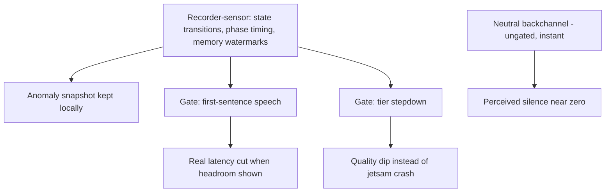

# Latency and Adaptive Tier Measurement Loop - Plan

## Goal Capsule

- **Objective:** Close a measurement-and-actuation loop on-device: a recorder-sensor samples pipeline state, timing, and memory locally, and three consumers act on those numbers — a neutral backchannel, first-sentence speech during streaming, and automatic LLM tier stepdown before the jetsam cliff.
- **Product authority:** Mitch; source ideation is `docs/ideation/2026-07-11-open-ideation.html` (ideas 1, 4, and 6 — idea 1 scoped down to an internal sensor).
- **Open blockers:** Three owed perf-review design findings (timeout enforcement, WhisperKit load bound, STT teardown await) are separate pre-build-14 work in the same pipeline; land them first or coordinate to avoid churn.

---

## Product Contract

### Summary

Add an internal, on-device recorder-sensor and let it gate behavior at runtime: perceived response silence drops to near zero via an instant neutral acknowledgment, real latency drops via first-sentence speech when local numbers show headroom, and sustained memory pressure steps the LLM down one tier between turns instead of letting iOS kill the app mid-answer. Onboarding stops asking the user to pick a model tier.

### Problem Frame

Transcript-to-first-speech currently carries the entire LLM generation — sentences are extracted mid-stream but only buffered, held back by a deliberate gate awaiting device measurement that has no harness. The memory-pressure ladder degrades and unloads TTS (~80MB twice) but never touches the LLM, the actual multi-gigabyte resident, so 6GB devices carry an unmonitored jetsam risk. Every one of these decisions is blocked on a human watching Instruments; nothing measures the three numbers that gate them.

### Key Decisions

- **The recorder is a local sensor, not telemetry.** Nothing leaves the device and nothing is sent back to the developer; its consumers are runtime policies on the same phone. No user-facing surface; a readout may exist in debug builds only.
- **Self-gating replaces the manual device-pass gate for these features.** They ship instrumented and enable themselves per-device when local numbers allow — "wait for a human pass" becomes "promote on data," device by device.
- **Backchannel clips are neutral-only.** The instant acknowledgment is content-blind by construction (no LLM has run yet), so clips are non-directive sounds ("mm", "hm") that sit acceptably over any close, including an emotional one. Directive phrases are banned from the clip set.
- **Stepdown is silent, between turns, and non-sticky.** A tier change never happens mid-generation, needs no user decision in the moment, and the user-selected tier is restored at next launch.
- **The fallback tier is pre-downloaded.** Stepping down to a tier not on disk would cost a full multi-GB download — useless mid-session — so the next tier down is fetched quietly after onboarding.
- **Onboarding auto-selects the RAM-recommended tier.** The picker moves to settings; the RAM-based recommendation already exists and already acts as the default when nothing is persisted, so onboarding stops surfacing a choice that can be wrong.
- **Memory thresholds stay untouched.** The ladder gains an LLM rung; its existing thresholds are not retuned here.

### Requirements

**Recorder-sensor**

- R1. A small in-memory ring buffer continuously records pipeline state transitions, per-phase timings, and memory watermarks.
- R2. On an anomaly (empty transcript, phase hang, near-jetsam memory), a snapshot persists to a local, size-capped store; nothing is ever transmitted off-device.
- R3. Sampling adds no locks on the audio render thread and negligible overhead to a turn.
- R4. The sensor has no user-facing surface; any readout exists in debug builds only.

**Backchannel**

- R5. The moment end-of-speech is detected, a short neutral acknowledgment clip plays at effectively zero latency, hiding LLM generation behind it.
- R6. Clips come from a small rotating set of non-directive sounds; the same clip never plays twice in a row, and no clip contains a directive phrase.
- R7. The backchannel requires no gate: it is safe on every tier and every device.

**First-sentence speech**

- R8. When locally measured conditions show headroom, the first extracted sentence is spoken while the rest of the response still streams; otherwise behavior stays collect-all-then-speak.
- R9. The gate decision is made per-device from sensor data (latency, memory under concurrent inference, absence of prior contention anomalies), not from a build-time flag.

**Adaptive tier**

- R10. Under sustained memory pressure, the LLM steps down one tier (quality to balanced to fast) between turns — never mid-generation — and the conversation continues with session context re-established on the new tier.
- R11. Stepdown only targets a tier already on disk; after onboarding, the next tier below the selected one is downloaded quietly in the background so stepdown is always instant.
- R12. Stepdown is silent in the moment and non-sticky: the user-selected tier is restored at next launch.
- R13. If no lower tier is available on disk yet, the existing ladder behavior (degrade and unload TTS) remains the fallback.

**Onboarding**

- R14. Onboarding no longer asks the user to pick a model tier; the RAM-recommended tier is selected automatically.
- R15. The tier picker remains available in settings, showing which tier is recommended for the device.

### Key Flows

- F1. **Turn with backchannel and first-sentence speech.**
  - **Trigger:** User stops speaking.
  - **Steps:** Neutral clip plays instantly; generation streams; if the first-sentence gate is open, sentence 1 is spoken as soon as extracted; remaining sentences follow.
  - **Covers:** R5, R6, R8, R9.
- F2. **Anomaly snapshot.**
  - **Trigger:** Empty transcript, hang, or near-jetsam watermark.
  - **Steps:** Ring buffer contents persist locally; gates consult anomaly history on later decisions.
  - **Covers:** R1, R2.
- F3. **Pressure stepdown mid-session.**
  - **Trigger:** Sustained memory pressure while a lower tier is on disk.
  - **Steps:** Current turn finishes; between turns the LLM swaps to the lower tier; session context re-establishes; conversation continues; selected tier restores next launch.
  - **Covers:** R10, R11, R12.

### Acceptance Examples

- AE1. **Covers R6.** Given the user ends a turn with a heavy emotional close, when the backchannel fires, then the clip is a neutral sound and no directive phrase plays over the moment.
- AE2. **Covers R8, R13.** Given a device whose sensor history shows contention anomalies, when a response streams, then speech starts only after full collection — current behavior, unchanged.
- AE3. **Covers R11, R13.** Given sustained pressure before the fallback tier finished downloading, when stepdown is considered, then no download is triggered mid-session and the existing TTS-degradation ladder handles the pressure.
- AE4. **Covers R12.** Given a session that stepped down to a lower tier, when the app next launches, then the user-selected tier is active again.

### Success Criteria

- Perceived response silence (stop-speaking to first sound) is effectively zero on every tier via the backchannel.
- On devices where the gate opens, transcript-to-first-speech no longer carries the full generation.
- No jetsam kill mid-answer on 6GB devices under sustained use; pressure produces a quality dip instead of a crash.

### Scope Boundaries

- **Deferred for later:** debug-build sensor readout polish, prosody variation on backchannel clips, any retuning of memory thresholds.
- **Out:** telemetry export or any data leaving the device; user-facing dashboards; a user-visible stepdown notification; changing tier download UX beyond the quiet fallback fetch.

### Dependencies / Assumptions

- The three owed perf-review findings are separate work and are not absorbed here; they touch the same pipeline and should land first.
- The owed iPhone 17 Pro device pass remains owed for the previously gated optimizations; this plan supplies the measurement harness rather than replacing that pass.
- Fallback-tier pre-download assumes users accept the extra disk cost (up to ~1.7GB for a quality-tier device); the settings picker still shows what is installed.
- No consistent user exists yet; acceptance is Mitch's own judgment at testing time.

### Outstanding Questions

- **Deferred to planning:** pre-download constraints (Wi-Fi-only, charging-only); what counts as "sustained" pressure before stepdown; exact anomaly definitions and snapshot retention; where the gate's decision state lives.

### Sources / Research

- `docs/ideation/2026-07-11-open-ideation.html` — ideas 1, 4, 6, basis-verified.
- Verified against working tree 2026-07-11: sentences buffered mid-stream behind the measurement-gated comment (`Lifehug/Lifehug/Pipeline/VoicePipeline.swift:289-296`, `:312-321`); the pressure ladder never touches the LLM (`Lifehug/Lifehug/Pipeline/VoicePipeline.swift:500-517`); model cache check is per-selected-tier, so an absent tier means a full download (`Lifehug/Lifehug/Services/ModelDownloader.swift:56-59`); the RAM-recommended default already exists (`Lifehug/Lifehug/App/ModelConfig.swift:134-139`); single-sentence TTS entry point exists today (`Lifehug/Lifehug/Services/TTSService.swift:42`); no canned-audio asset or playback path exists yet.
- Prior gating decisions: `docs/plans/2026-07-05-001-fix-voice-pipeline-stt-tts-reliability-plan.md` (KTD2, U14/P2-9).
