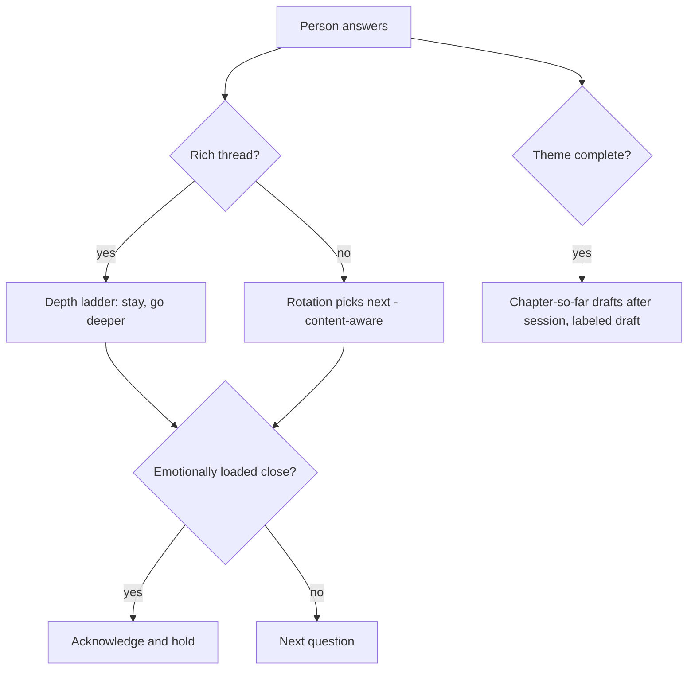

# Humane Interviewer and Chapter Payoff - Plan

## Goal Capsule

- **Objective:** Turn the interviewer from a form into a listener — question selection that reads what the person said, follow-up depth on rich threads, restraint on emotional closes, plus past-answer and photo seeds — and give the project ongoing value by auto-generating a chapter-so-far when a theme completes, guarded by a golden-set generation eval.
- **Product authority:** Mitch; source ideation is `docs/ideation/2026-07-11-open-ideation.html` (ideas 5 and 7, including the two extensions).
- **Open blockers:** None hard. Interviewer changes are LLM-prompt/orchestration work best evaluated with the golden set in place; chapter payoffs interact with consent scope decided in `docs/plans/2026-07-11-001-feat-keep-voice-verbatim-provenance-plan.md`.

---

## Product Contract

### Summary

Make the interviewer content-aware and humane in three moves — selection that considers answer content, a bounded depth ladder for rich threads, and holding rather than talking over an emotionally loaded close — extended with past-answer resurfacing and photo+caption seeds. Separately, auto-generate a labeled draft "chapter so far" in the foreground when a theme completes, so the project pays off before the book is done. A golden-set eval makes interviewer and generation changes measurable.

### Problem Frame

Question selection today never reads a word the person said: it scores only answered/total ratios per category. The interviewer prompt pins one question and caps responses at two short sentences, so a rich thread gets one follow-up and then the rotation snaps back regardless of what was shared. Nothing detects an emotionally loaded close, and the only payoff a user ever sees is a book chapter they must request by hand after enough answers — journaling-category evidence says most users quit within a week when there is no ongoing value. Oral-history practice (StoryCorps) says tangents are where the real material lives; the current structure cannot chase them.

### Key Decisions

- **All three interviewer moves ship together, plus both extensions.** Content-aware selection, the depth ladder, hold-on-close, past-answer resurfacing, and photo+caption seeds — chosen over a moves-only cut.
- **Rotation stays the spine.** The ladder and content-aware selection bias and deepen; the rotation's category-coverage guarantee remains the fallback, so the book's breadth is never sacrificed to a tangent.
- **Chapter-so-far triggers on theme completion, in the foreground.** Generation runs after a session ends while the app is open — no background machinery — and never contends with the live audio stack.
- **Payoffs are exempt from consent.** A chapter-so-far arrives as a clearly labeled draft; the ratification flow guards final book chapters only (decision shared with the trust plan).
- **This reverses the on-demand-only generation stance.** The 2026-03-07 book-tab plan chose "don't waste compute pre-generating"; unprompted payoff generation is a deliberate reversal, motivated by retention being upstream of every other feature's value.
- **Photo seeds use photos already on the device.** No family-to-elder sending channel exists, and none is added here.
- **A golden-set eval guards quality.** A fixed set of transcripts plus assertions (no reasoning-tag leaks, first person, quote fidelity) runs on every prompt or tier change, replacing swap-and-pray.

### Requirements

**Content-aware selection**

- R1. Question selection considers the content of prior answers, not only category-coverage ratios; rotation's coverage guarantee remains the floor.
- R2. Past answers can resurface as prompts: the person's own earlier words occasionally seed a question that invites returning to or deepening a story.
- R3. A photo with a caption, chosen from the device library, can seed a question.

**Depth ladder**

- R4. When an answer is rich, the interviewer may stay on the thread for multiple follow-ups instead of snapping back to rotation after one.
- R5. The ladder is bounded: the person can always move on, and the session never traps them on a thread.

**Emotional closes**

- R6. When a turn ends on an emotionally loaded close, the interviewer acknowledges and holds — no next question fires over the moment.

**Chapter payoff**

- R7. When a theme (category) completes, a chapter-so-far draft auto-generates and is surfaced unprompted, clearly labeled as a draft.
- R8. Payoff generation runs in the foreground after the session ends and never contends with live audio capture or playback.
- R9. Payoff drafts carry no consent state; ratification applies only at book finalization.

**Quality guard**

- R10. A golden-set eval — fixed transcripts with assertions covering reasoning-tag leaks, first-person voice, and quote fidelity — is runnable against any interviewer-prompt or model-tier change.
- R11. Interviewer changes in this plan pass the golden set before shipping.

### Key Flows

- F1. **Rich-thread session.**
  - **Trigger:** An answer shows unusual richness (detail, emotion, new people or places).
  - **Steps:** Interviewer follows up and stays on the thread up to the ladder bound; on thread end, content-aware selection picks what is next; coverage floor holds.
  - **Covers:** R1, R4, R5.
- F2. **Emotional close.**
  - **Trigger:** A turn ends on a loaded note.
  - **Steps:** Acknowledgment, pause; no immediate next question; session continues only on the person's signal.
  - **Covers:** R6.
- F3. **Theme completes.**
  - **Trigger:** The last question of a category is answered mid-session.
  - **Steps:** Session continues normally; after it ends, a chapter-so-far generates in the foreground and appears as a labeled draft.
  - **Covers:** R7, R8, R9.
- F4. **Prompt change.**
  - **Trigger:** Any interviewer-prompt or tier change during development.
  - **Steps:** Golden set runs; assertions pass before the change ships.
  - **Covers:** R10, R11.

### Acceptance Examples

- AE1. **Covers R5.** Given the interviewer is three follow-ups deep on a thread, when the person gives a short or closing answer, then the ladder ends and selection moves on — no further probing on that thread.
- AE2. **Covers R6.** Given a turn ending "...and that was the last time I saw her," when the response comes, then it acknowledges without asking a question, and the next question waits for the person to continue.
- AE3. **Covers R7, R8.** Given the final question of a category is answered mid-session, when the session is still active, then no generation runs; after the session ends, the draft appears.
- AE4. **Covers R1.** Given prior answers mention a recurring person, when selection runs, then a question about that person can be chosen even if its category is not the ratio-based pick, while overall coverage still trends complete.

### Success Criteria

- Golden-set assertions pass on every interviewer change (R10/R11) — the measurable guard.
- Qualitative bar, judged by Mitch at testing time: sessions feel like being listened to (threads chased, closes respected), and a completed theme produces a draft worth reading without asking.

### Scope Boundaries

- **Deferred for later:** overnight/background generation (BGTaskScheduler is net-new machinery), other payoff forms (pull-quote card, single-answer vignette), every-N-answers triggering, spotlight-category payoffs.
- **Out:** a family-to-elder photo sending channel; witness mode (a family member operating the interview); any analytics or usage tracking — success stays partly unobservable by design.

### Dependencies / Assumptions

- Retention evidence (~87% of journaling users quit within 7 days) is category-level, not measured for Lifehug.
- Chapter generation already accepts partial answer sets, so early generation needs no generator change; the 3-answer floor lives in UI today.
- The dormant root Python system already generates follow-up questions back into the question bank; it is prior art for content-aware behavior, but the iOS app carries no pass concept and none is introduced here.
- Payoff quality on partial data from small tiers may underwhelm; the golden set plus draft labeling are the mitigations.
- No consistent user exists yet; acceptance is Mitch's own judgment at testing time.

### Outstanding Questions

- **Deferred to planning:** how richness and emotional load are detected (prompt-level vs orchestration heuristics — no new ML); ladder bound value; how resurfaced answers and photo seeds enter the question bank; where golden-set fixtures live and how the eval runs.

### Sources / Research

- `docs/ideation/2026-07-11-open-ideation.html` — ideas 5 and 7 (6 and 4 frames converged respectively), quick-wins sidebar item (c) for the golden-set eval.
- Verified against working tree 2026-07-11: selection reads only answered/total ratios (`Lifehug/Lifehug/Services/RotationEngine.swift:34-49`); prompt pins one question, max two sentences, 150 tokens (`Lifehug/Lifehug/Services/LLMService.swift:54`, `:346-364`); generator has no answer floor, UI does (`Lifehug/Lifehug/Views/AnswersBrowserView.swift:469`); no background-processing machinery exists; engagement surface is one static daily notification (`Lifehug/Lifehug/Views/SettingsView.swift:680`).
- Reversed stance: `docs/plans/2026-03-07-feat-voice-first-ux-and-book-tab-plan.md` (on-demand generation decision).
- StoryCorps field method and the journaling-churn statistic per the ideation doc's market research.
