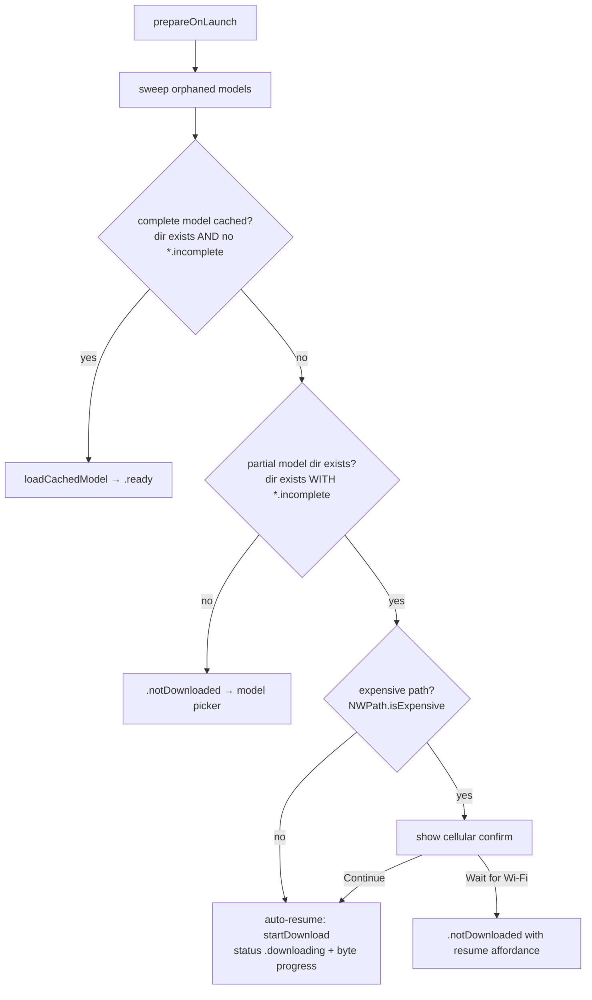

# fix: Byte-accurate model-download progress, partial-download resume, and cellular guard

## Summary

The on-device LLM download engine works — it downloads, resumes across launches, and verifies correctly — but the app reports its progress so badly that a working multi-GB download looks permanently broken, so users force-quit before it finishes and the app never starts. This plan fixes the reporting and routing, not the engine: drive the progress readout from actual bytes on disk, stop treating a half-finished download as a ready model, auto-resume a partial download with a visible progress bar on relaunch, and confirm before a large download starts on a cellular/hotspot connection.

Root causes are confirmed against the vendored source (swift-transformers 1.1.9, mlx-swift-lm 2.30.6) and the repo's own test comment. The libraries are not modified — all fixes are in app code.

**Product Contract preservation**: solo plan (no upstream brainstorm); requirements below are authored here.

---

## Problem Frame

Diagnosed via `/ce-debug` this session. Four observed symptoms trace to three code defects, all in the iOS app:

- **"0 / 0 MB" during download (RC1, confirmed).** `Lifehug/Lifehug/Services/ModelDownloader.swift:248-249` computes `downloadedMB`/`totalMB` by dividing `progress.completedUnitCount`/`totalUnitCount` by 1,000,000. That `Progress` is swift-transformers' snapshot **top-level** progress, whose units are **file counts, not bytes** (`HubApi.swift:923` → `Progress(totalUnitCount: filenames.count)`; each file a child with `pendingUnitCount: 1` at `HubApi.swift:925`). The glob matches `["*.safetensors","*.json","*.jinja"]` (mlx-swift-lm `Load.swift:30`) → ~6-8 files → `7 / 1_000_000 ≈ 0.000007` → renders `%.0f` as `0`, and since it is `> 0` the two-number branch at `Lifehug/Lifehug/Views/LaunchView.swift:187` prints exactly **"0 / 0 MB"**.
- **"Frozen at ~71%" (RC2, confirmed behavior).** The bar weights **every file as 1/N regardless of byte size** (`HubApi.swift:925`). `model.safetensors` (~2.4 GB) is ~95% of the bytes but one file-slice of the bar, so the bar sits flat at a file boundary (5/7 ≈ 71%) for minutes with no MB readout to signal motion. The repo's own test already documents this: `Lifehug/LifehugTests/ModelDownloaderTests.swift:182-183` ("the reported Progress can stay at 0 for minutes into a multi-GB single-file transfer even while bytes land on disk"). It is not a network hang — Xet is disabled (no `swift-xet` in `Package.resolved`), so all files use the LFS path, and the default `URLSession` (60 s request timeout, `waitsForConnectivity=false`) would throw `NSURLErrorTimedOut` into `errorView` on a real stall, not freeze.
- **Relaunch "stuck at 0%" (RC3, confirmed).** `cachedModelOption` (`ModelDownloader.swift:69-83`) treats a model as cached whenever its `models--<repo>` **directory exists**, with no completion check; HubApi creates that directory at download start (`HubApi.swift:804-805`). So after a partial download + force-quit, `prepareOnLaunch` (`ModelState.swift:48-51`) sets `status = .loading` and calls `loadCachedModel` → `loadModel` (`ModelDownloader.swift:271-274`), which passes progress handler `{ _ in }` (ignored) and shows the bare `loadingView` spinner (`LaunchView.swift:195-205`, no percent) while silently resuming the download → "stuck at 0%".
- **App never starts (RC4).** Consequence of RC1-3: resume actually works across launches, but the UX hides all progress, so users force-quit repeatedly and never reach the ready state.

---

## Requirements

- **R1** — The download screen shows `downloaded / total MB` computed from real bytes on disk, updating steadily as the transfer proceeds.
- **R2** — The progress bar advances in proportion to bytes downloaded, with no minutes-long flat stall during the large weights file.
- **R3** — A partial or incomplete download is never reported as a cached or ready model.
- **R4** — On relaunch with a partial download, the app auto-resumes and shows byte-accurate progress (not a bare spinner), subject to R6.
- **R5** — Users who already downloaded a model on builds 13/14 stay cached and are not forced to re-download.
- **R6** — Before starting or resuming a download on an expensive (cellular / personal hotspot) connection, the app asks the user to continue on cellular or wait for Wi-Fi.
- **R7** — Regression tests cover byte-accurate progress, completeness detection, launch routing, and the cellular decision, using the existing temp-directory test harness (runnable on the simulator).

---

## Key Technical Decisions

- **KTD1 — Measure progress from bytes on disk, not the library `Progress`.** A lightweight poll sums the size of files under `…/huggingface/hub/models--<repo>/` (finalized blobs plus `*.incomplete` partial blobs) while downloading. Rationale: the library's `fractionCompleted` and unit counts are unusable for bytes (file-count-weighted and flat within a large file — confirmed by the repo's own test comment). On-disk byte summation is monotonic and accurate regardless of the library's reporting. `fractionCompleted × diskSizeMB` is explicitly rejected because `fractionCompleted` is itself flat during the big file.
- **KTD2 — Completeness = no `*.incomplete` blobs under the model directory.** Rationale: this is true for already-downloaded users (their finalized downloads contain no `.incomplete` files) and false for partials, so it fixes RC3 without breaking R5. A self-written completion marker is rejected because existing cached users would lack it and be forced into a multi-GB re-download.
- **KTD3 — `totalMB` comes from `selectedModel.diskSizeMB` (known constant); progress is clamped to [0, 1] and kept monotonic.** Rationale: the true remote byte total is not reliably exposed at the top level; the per-tier constant (fast 771 / balanced 1747 / quality 2599) is close enough for a readout and stable. Display clamps so real-bytes-slightly-over-estimate never shows >100% and never moves backward.
- **KTD4 — Cellular detection via `NWPath.isExpensive`.** Rationale: Apple's intended "expensive interface" signal, covering cellular and personal hotspot — the exact case worth confirming for a large download. `usesInterfaceType(.cellular)` (strict cellular, excludes hotspot) is the documented alternative if hotspot should be allowed silently; `isExpensive` is chosen as the safer default. (Verified against Apple Network framework docs.)
- **KTD5 — Launch routing is a pure, testable decision function; the simulator guard wraps only the MLX calls.** Rationale: `prepareOnLaunch`'s `#if targetEnvironment(simulator)` early-return exists because MLX crashes on the simulator's missing Metal GPU. Filesystem completeness/partial detection and the routing decision do **not** touch MLX, so they are computed by a pure function testable on the simulator; only the actual `loadCachedModel`/`startDownload` calls stay behind the guard.

---

## High-Level Technical Design

Launch routing after the fixes (RC3 + R4 + R6):

Progress source change (RC1 + RC2): the library progress callback is no longer read for values. A poll task owned by `ModelDownloader` walks the model directory every ~0.5 s while `phase == .downloading`, sums bytes off the main actor, and publishes `downloadedMB` (real), `totalMB` (`= diskSizeMB`), and `progress` (`= min(bytes / (diskSizeMB·1e6), 1)`, monotonic) back on the main actor. The existing ~10 Hz UI throttle intent is preserved by the poll cadence.

---

## Implementation Units

### U1. Byte-accurate download progress from on-disk measurement

**Goal**: Replace the file-count-based `downloadedMB`/`totalMB`/`progress` writes with values derived from actual bytes on disk, so the readout and bar reflect real transfer (fixes RC1 + RC2 / R1 + R2).

**Requirements**: R1, R2.

**Dependencies**: none.

**Files**:
- `Lifehug/Lifehug/Services/ModelDownloader.swift` (modify)
- `Lifehug/LifehugTests/ModelDownloaderTests.swift` (extend)

**Approach**:
- Add a `nonisolated static func modelDirectoryBytes(_ modelDir: URL) -> Int64` that recursively sums regular-file sizes under a `models--<repo>` directory (counts both finalized `blobs/` and `*.incomplete` partial blobs). Keep it filesystem-only and pure so it is testable against a temp directory.
- In `startDownload`, set `totalMB = Double(ModelConfig.LLM.selectedModel.diskSizeMB)` and start a poll `Task` (interval ~0.5 s) that, while `phase == .downloading`, computes bytes off the main actor (`Task.detached` or the `nonisolated static` helper), then hops to the main actor to publish: `downloadedMB = bytes / 1_000_000` and `progress = min(Double(bytes) / (Double(diskSizeMB) * 1_000_000), 1.0)`. Enforce monotonicity (never publish a value lower than the last).
- Stop trusting the library `Progress` for values: reduce the `loadContainer` progress closure at `ModelDownloader.swift:239-251` to a no-op (or activity-only) and delete the file-count `completedUnitCount`/`totalUnitCount` math at lines 248-249.
- On success (`performDownload` after `loadContainer` returns), cancel the poll task and set `progress = 1.0`, `downloadedMB = totalMB`. Cancel the poll in `cancelDownload`/`deleteCache` too.
- The model resolves the repo directory as `storage.modelsDirectory/huggingface/hub/models--<repo>` (same layout `cachedModelOption` already uses); reuse a shared helper for that path.

**Patterns to follow**: mirror the existing `nonisolated static` filesystem helpers and the `sweepOrphanedModels(hubDirectory:)` test seam already in `ModelDownloader.swift`; keep observable-state writes on `@MainActor` as the file already does.

**Execution note**: write the byte-sum + monotonic-progress test first against a temp model directory before wiring the poll task.

**Test scenarios** (extend `ModelDownloaderTests.swift`, temp-dir harness):
- `modelDirectoryBytes` sums a temp `models--<repo>` containing several blob files (including one `*.incomplete`) to the exact total byte count.
- `modelDirectoryBytes` on an empty/absent directory returns 0 without error.
- Progress mapping: given `diskSizeMB = 2599` and 1,299,500,000 bytes on disk, computed `progress ≈ 0.5` and `downloadedMB ≈ 1299`.
- Clamp: bytes exceeding `diskSizeMB·1e6` yield `progress == 1.0` and `downloadedMB == totalMB`, never >100%.
- Monotonic: a later poll reporting fewer bytes than an earlier one does not lower the published `progress`/`downloadedMB`.

**Verification**: on a device, the download screen shows a steadily climbing `N / 2599 MB` and a bar that advances through the large weights file instead of pinning at ~71%.

---

### U2. Completeness gate and partial-download auto-resume routing

**Goal**: Stop treating a partial download as cached, and on relaunch route a partial into the progress-showing download path instead of the silent load spinner (fixes RC3 / R3, R4, R5).

**Requirements**: R3, R4, R5.

**Dependencies**: U1 (auto-resume relies on the byte-accurate progress it produces).

**Files**:
- `Lifehug/Lifehug/Services/ModelDownloader.swift` (modify)
- `Lifehug/Lifehug/App/ModelState.swift` (modify)
- `Lifehug/LifehugTests/ModelDownloaderTests.swift` (extend)

**Approach**:
- Add `nonisolated static func isModelDirComplete(_ modelDir: URL) -> Bool` returning `true` when no `*.incomplete` file exists anywhere beneath the directory (KTD2).
- Change `cachedModelOption` (`ModelDownloader.swift:69-83`) to return an option only when its `models--<repo>` directory exists **and** `isModelDirComplete` is true. Add `incompleteModelOption` returning an option whose directory exists but is **not** complete.
- Add a pure routing function `nonisolated static func launchRoute(cached: ModelOption?, incomplete: ModelOption?) -> LaunchRoute` where `LaunchRoute` is `.loadCached(ModelOption)`, `.resumeDownload(ModelOption)`, or `.showPicker` — cached wins, else incomplete resumes, else picker (KTD5).
- Rework `prepareOnLaunch` (`ModelState.swift:34-67`): keep the `#if targetEnvironment(simulator)` guard around the MLX calls only. Compute `launchRoute` from the (simulator-safe) filesystem checks, then: `.loadCached` → set selection + `loadCachedModel` (today's path); `.resumeDownload` → set selection + go through the download path (subject to U3's cellular gate) so `status` becomes `.downloading` with real progress; `.showPicker` → `.notDownloaded`.
- Leave `loadModel`/`loadCachedModel` otherwise unchanged; the fix is that a partial no longer reaches them.

**Patterns to follow**: the existing `cachedModelOption` directory-scan style and the `withHubDirectory(containing:)` temp-dir test harness in `ModelDownloaderTests.swift`.

**Execution note**: implement `isModelDirComplete` and `launchRoute` test-first; both are pure and fully covered on the simulator.

**Test scenarios**:
- Complete dir (blobs, no `*.incomplete`) → `isModelDirComplete == true`; `cachedModelOption` returns that tier; `isModelCached == true` (protects R5).
- Partial dir (contains a `*.incomplete` blob) → `isModelDirComplete == false`; `cachedModelOption == nil`; `incompleteModelOption` returns that tier; `isModelCached == false`.
- `launchRoute(cached: .quality, incomplete: nil) == .loadCached(.quality)`.
- `launchRoute(cached: nil, incomplete: .quality) == .resumeDownload(.quality)`.
- `launchRoute(cached: nil, incomplete: nil) == .showPicker`.
- Mixed nested layout: an `*.incomplete` file inside a `blobs/` subdirectory is still detected (recursive walk).

**Verification**: on a device, force-quit mid-download then relaunch — the app resumes into the download screen with a climbing progress bar (not a bare "Preparing…" spinner), and a fully-downloaded model still loads straight to ready.

---

### U3. Cellular-aware confirmation before large downloads

**Goal**: Detect an expensive (cellular / hotspot) connection and confirm with the user before a download starts or auto-resumes on it (R6).

**Requirements**: R6, R4 (gates the auto-resume from U2).

**Dependencies**: U2 (auto-resume routing is the primary caller of the gate).

**Files**:
- `Lifehug/Lifehug/Services/NetworkStatus.swift` (new)
- `Lifehug/Lifehug/App/ModelState.swift` (modify)
- `Lifehug/Lifehug/Views/LaunchView.swift` (modify)
- `Lifehug/LifehugTests/ModelDownloaderTests.swift` (extend, or a new `NetworkStatusTests.swift`)

**Approach**:
- New `NetworkStatus` helper wrapping a one-shot async check: create an `NWPathMonitor`, set `pathUpdateHandler`, `start(queue:)` on a dedicated serial queue, await the first path via a `withCheckedContinuation` (guard against double-resume), read `path.isExpensive`, then `cancel()`. Return `Bool` (`isExpensive`). Use `NWPath.isExpensive` per KTD4.
- Add a pure decision function `nonisolated static func downloadGate(isExpensive: Bool, sizeMB: Int) -> DownloadGate` returning `.proceed` or `.confirmCellular(sizeMB:)` — testable without a live network.
- In `ModelState`, add `requestDownload()` that runs the one-shot check, applies `downloadGate`, and either calls the existing `triggerDownload()` or sets an observable `pendingCellularConfirm` flag. Route both the picker's Download button and U2's `.resumeDownload` through `requestDownload()`.
- In `LaunchView`, present a confirmation (alert or sheet) when `pendingCellularConfirm` is set: "You're on cellular — this is a `<downloadSizeLabel>` download. Continue on cellular, or wait for Wi-Fi?" Continue → `triggerDownload()`; Wait → return to `.notDownloaded` with the resume affordance (the download stays partial on disk for a later Wi-Fi resume).

**Patterns to follow**: `ModelConfig.LLM.ModelOption.downloadSizeLabel` for the size string; existing `@Observable @MainActor` state on `ModelState`; the existing error/confirmation view style in `LaunchView`.

**Execution note**: concurrency care — `NWPathMonitor` fires its handler on a background queue; wrap with a single-resume continuation and keep `NWPath` (Sendable) crossing the actor boundary cleanly. Verify under a Release archive (stricter Swift 6 concurrency). The monitor wrapper itself is device/integration-tested; unit-test the pure `downloadGate` decision.

**Test scenarios**:
- `downloadGate(isExpensive: false, sizeMB: 2599) == .proceed`.
- `downloadGate(isExpensive: true, sizeMB: 2599) == .confirmCellular(sizeMB: 2599)`.
- Routing: with `isExpensive == true`, `requestDownload()` sets `pendingCellularConfirm` and does **not** start the download until confirmed (assert via the observable flag / a seam that doesn't require a live download).
- `Test expectation: NWPathMonitor wrapper` — none at unit level (requires a real interface); covered by device verification below.

**Verification**: on a device on cellular, tapping Download (or relaunching with a partial) shows the cellular confirmation; on Wi-Fi it proceeds without a prompt.

---

## Scope Boundaries

**In scope**: progress reporting from on-disk bytes; completeness gate; partial-relaunch auto-resume with progress; cellular/hotspot confirmation; regression tests via the temp-dir harness. Applies to all three tiers.

**Not doing (out of this product's shape)**:
- Modifying the vendored libraries (swift-transformers, mlx-swift-lm) — fixes are app-side only.
- Switching to a background `URLSession` or enabling the Xet transport.

### Deferred to Follow-Up Work
- Retry/backoff hardening for genuine network stalls (current default 60 s timeout surfaces as the existing `errorView`; acceptable for now).
- A dedicated "Resume download" screen with remaining-size affordance beyond the minimal Wait-for-Wi-Fi return state.
- Persisting a "user accepted cellular for this download" choice so a mid-download background/return doesn't re-prompt.

---

## Risks & Dependencies

- **`diskSizeMB` drift vs. real bytes (low).** If a repo's real size diverges from the per-tier constant, the bar may reach 100% slightly early or late. Mitigated by clamping and the completion signal snapping to 100%. Revisit the constants if a tier's real size changes materially.
- **Poll cost (low).** A 0.5 s recursive directory walk over a handful of blob files is cheap; run off the main actor. Cancel promptly on completion/cancel.
- **Swift 6 concurrency in the `NWPathMonitor` wrapper (medium).** The background-queue handler crossing into async/`@MainActor` is the most likely place for a Release-only concurrency error. Verify with an archive build, not just Debug.
- **Simulator cannot exercise the real download** (`prepareOnLaunch` returns mock on simulator). Unit tests cover every pure/filesystem seam; the end-to-end download, resume, and cellular prompt require a device pass.

---

## Verification Contract

- All new unit tests pass on `xcodebuild test` (iPhone 17 simulator) — byte-sum, progress mapping/clamp/monotonic, completeness detection, launch routing, cellular gate decision.
- Release **archive** builds clean under Swift 6 strict concurrency (per project Known Issues — Release is stricter than Debug).
- Device pass: (a) a fresh Quality-tier download shows climbing `N / 2599 MB` and a bar that advances through the weights file; (b) force-quit mid-download then relaunch auto-resumes into the progress screen; (c) an already-cached model still loads straight to ready; (d) on cellular, the confirmation appears before download/resume.

## Definition of Done

- R1-R7 satisfied; U1-U3 landed with their test scenarios green on the simulator.
- Release archive verified.
- Device verification items (a)-(d) confirmed, or explicitly handed off as the remaining manual gate if no device is available at implementation time.

---

## Sources & Research

- `/ce-debug` diagnosis, this session — full causal chain for RC1-RC4 with file:line references.
- Vendored source read directly: `swift-transformers` 1.1.9 (`Sources/Hub/HubApi.swift` snapshot/progress/download), `swift-huggingface` (`HubClient+Files.swift` LFS vs Xet, `DownloadProgressDelegate`), `mlx-swift-lm` 2.30.6 (`Libraries/MLXLMCommon/Load.swift` glob, `ModelFactory.swift`). Xet confirmed disabled via `Package.resolved` (no `swift-xet`) and the `Xet` trait being off.
- Repo corroboration: `Lifehug/LifehugTests/ModelDownloaderTests.swift:182-183` documents the flat-progress behavior.
- Apple Network framework docs (Context7): `NWPath.isExpensive` (cellular + personal hotspot), `usesInterfaceType(_:)`, `NWPathMonitor.currentPath` / `pathUpdateHandler`.
